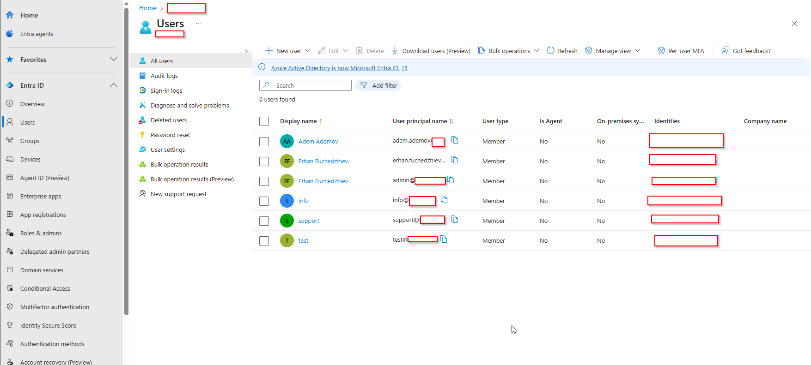
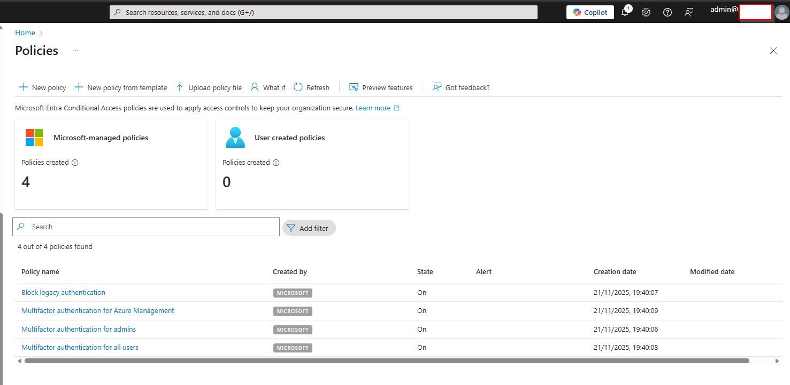

# Identity Setup in My Tenant

In my Contoso Ltd tenant, I implemented a cloud-only identity model designed for a secure and scalable Modern Workplace foundation. This section documents the identity structure, admin role governance, and Conditional Access policies that establish my Zero Trust strategy.

## 1. Current User Directory

| Display Name          | UPN                                                                       | Account Type | Notes                                                           |
| --------------------- | ------------------------------------------------------------------------- | ------------ | --------------------------------------------------------------- |
| **Adem Ademov**       | [adem.ademov@contoso.cloud](mailto:adem.ademov@contoso.cloud)             | Member       | Standard user                                                   |
| **Erhan Fuchedzhiev** | [erhan.fuchedzhiev@contoso.cloud](mailto:erhan.fuchedzhiev@contoso.cloud) | Member       | Standard user                                                   |
| **Admin**             | [admin@contoso.cloud](mailto:admin@contoso.cloud)                         | Member       | **Global Administrator**                                        |
| **info**              | [info@contoso.cloud](mailto:info@contoso.cloud)                           | Member       | Functional account                                              |
| **support**           | [support@contoso.cloud](mailto:support@contoso.cloud)                     | Member       | Support/Helpdesk mailbox                                        |
| **test**              | [test@contoso.cloud](mailto:test@contoso.cloud)                           | Member       | Used for testing Conditional Access, MFA, and Intune enrollment |

I designed these identities intentionally so I can test user experience, access policies, and administrative workflows in a realistic way.

This screenshot shows:

- All accounts are cloud-only
- No on-premises sync
- Only admin@contoso.cloud has Global Admin permissions

## 2. Admin Roles & Privileged Access Management
How I Manage Admin Roles

Only admin@contoso.cloud has Global Administrator access in my tenant.
I use this account exclusively for elevated operations and I never sign in with it for daily work.

My next step is to move this role into Privileged Identity Management (PIM) so it becomes eligible instead of permanent.
This helps me follow the Zero-Trust model and Least Privilege principles.

## 3.Conditional Access Baseline

To secure identity in my tenant, I built a small but strong set of Conditional Access policies.
Before creating my own policies, Microsoft automatically deployed several baseline Conditional Access policies when I disabled Security Defaults. These included:

- Blocking legacy authentication
- Enforcing MFA for all users
- Enforcing MFA for administrators and Azure management actions
- These provided me with a secure foundation to build upon.

Then, I created my own Conditional Access baseline to meet the requirements of my Modern Workplace project:

- Require MFA for all users (custom version with my exclusions)
- Require a compliant device for Exchange, SharePoint, OneDrive, and Teams
- Protect administrator portals with a dedicated policy
- Enforce sign-in risk and user risk remediation

These policies give me a Zero Trust foundation for the rest of my Modern Workplace environment.

