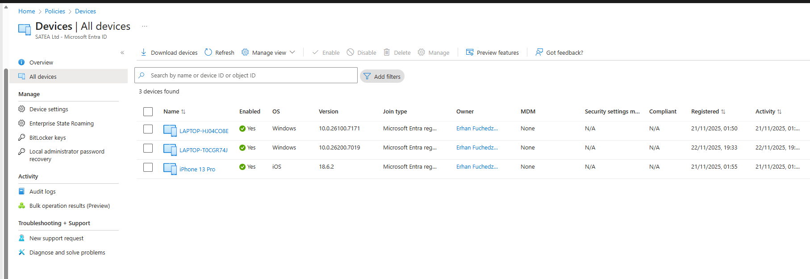

# 03 – Device Management & Intune  
### Modern Device Management with Microsoft Intune

In this part of my Modern Workplace project, I enrolled my Windows device using the **Company Portal** and then built a complete Intune baseline using configuration profiles, update rings, security hardening, and device restriction policies.

This article summarizes the entire workflow and includes links to each detailed sub-article.

---

## 1. Device Enrollment – Company Portal

I began by downloading the **Company Portal** app and enrolling my Windows device into Intune.

After enrollment, the device became fully managed:

- Compliance evaluation  
- Configuration policy deployment  
- Security controls  
- Windows updates  
- Application management  
- Real-time monitoring  

Once enrolled, I continued with building all required Intune policies listed below.

---

## 2. Windows Autopilot Deployment

**Documentation:**  
[01-autopilot-deployment.md](../docs/01-autopilot-deployment.md)

Configured Windows Autopilot and assigned it to the **Autopilot Devices** group, enabling:

- Zero-touch provisioning  
- Standardized configuration  
- Automatic Intune enrollment  

---

## 3. Compliance Policy Overview

**Documentation:**  
[02-compliance-overview.md](../docs/02-compliance-overview.md)

Created a compliance baseline enforcing:

- Secure Boot  
- Antivirus enabled  
- TPM  
- BitLocker  
- Minimum OS requirements  

Only compliant devices can access corporate data.

---

## 4. Windows Security Hardening

**Documentation:**  
[03-windows-security-hardening.md](../docs/03-windows-security-hardening.md)

Applied OS-level hardening:

- Disable legacy protocols  
- Firewall rules  
- Local security policies  
- Credential protection  

This forms the foundation for the remaining security layers.

---

## 5. Attack Surface Reduction (ASR)

**Documentation:**  
[04-attack-surface-reduction-(asr).md](../docs/04-attack-surface-reduction-(asr).md)

Enabled key Microsoft Defender ASR rules:

- Block Office macros  
- Block executable email content  
- Block credential theft  
- Block untrusted scripts  

Significantly reduces malware, phishing, and exploitation attempts.

---

## 6. OneDrive Known Folder Move (KFM)

**Documentation:**  
[05-onedrive-known-folder-move-(kfm).md](../docs/05–onedrive-known-folder-move-(kfm).md)

Automatically redirected user folders:

- Desktop  
- Documents  
- Pictures  

This ensures user data is backed up and synced across devices.

---

## 7. Windows Update Rings

**Documentation:**  
[06-windows-update-rings.md](../docs/06-windows-update-rings.md)

Configured a safe multi-ring Windows Update strategy:

| Ring | Audience | Quality Deferral | Feature Deferral |
|------|-----------|------------------|------------------|
| **0 – IT** | IT/admin machines | 0 days | 0 days |
| **1 – Users** | All users | 7 days | 14 days |
| **2 – Extended** | Sensitive systems | 14 days | 30 days |

Provides staged rollout with controlled stability.

---

## 8. Microsoft Edge Browser Policies

**Documentation:**  
[07-microsoft-edge-browser-policies.md](../docs/07-microsoft-edge-browser-policies.md)

Implemented modern browser security controls:

- SmartScreen  
- Block external extensions  
- Homepage: https://www.office.com  
- Password manager controls  
- Enhanced Security Mode  
- Tracking prevention  

Ensures a secure and consistent Edge experience.

---

## 9. Windows Device Restriction Policies

**Documentation:**  
[08-windows-device-restriction-policies.md](../docs/08–windows-device-restriction-policies.md)

Configured advanced restriction settings:

- Deny USB/removable storage  
- Control copy/paste to external sources  
- Restrict Control Panel access  
- Limit privilege elevation  
- Reduce local admin exposure  

Protects devices from data leakage and unauthorized configuration changes.

---

# Final Result

With all steps completed, my Modern Workplace baseline now includes:

- Device enrollment via Company Portal
- Autopilot provisioning  
- Compliance policies  
- OS security hardening  
- Attack Surface Reduction  
- OneDrive automation  
- Update rings  
- Edge browser hardening  
- Device restriction policies  

This creates a **secure, cloud-managed, automated, and scalable Windows management environment** aligned with Microsoft 365 best practices.
