# 06 – Teams Collaboration & Security Hardening

In this section of my Modern Workplace & Copilot deployment project, I’m configuring Microsoft Teams to ensure secure, compliant, and well-governed collaboration across the organization. I’m defining external access, guest access, meeting & messaging policies, content sharing controls, live events, templates, app governance, and update policies.

My goal is to create a standard, repeatable baseline that balances collaboration with strong security.

---

## 1. External Access Configuration

External access controls how users in my organization can communicate with users from other tenants or unmanaged accounts.

Settings configured

- Manage external domains: On
- Allow all external domains: Enabled
- Unmanaged (consumer) Teams accounts: Allowed
- Block communication with users in trial tenants: Off
- Custom app users / ACS users: Off
- Security team domain management: Off

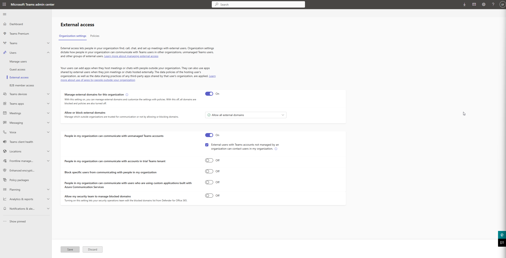

---

## 2. Guest Access Configuration

Guest access defines what external guests can do inside Teams once invited.

Settings configured
Calling

- Private calls: Off
- Meeting participation
- Video conferencing: On
- Screen sharing: Entire screen
- Meet now: Off
- Participants can give control: Off
- External participants can get control: Off

Messaging

- Edit sent messages: Off
- Delete messages: Off
- Delete bot messages: Off
- Delete chat: Off
- Chat: On
- Giphy, Memes, Stickers: On
- Giphy content rating: PG
- Immersive reader: On

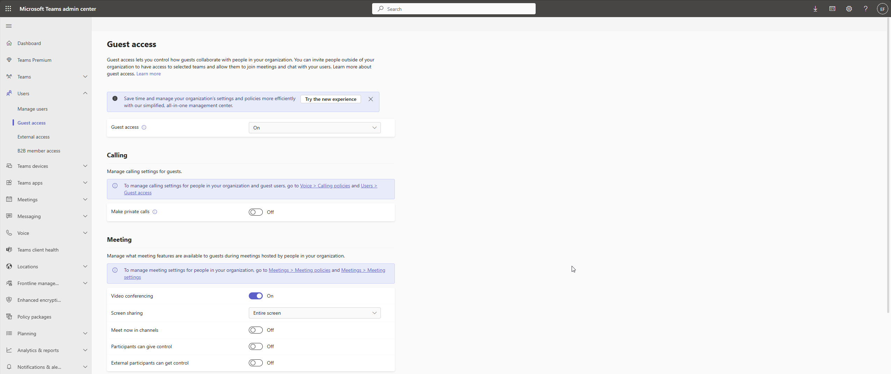

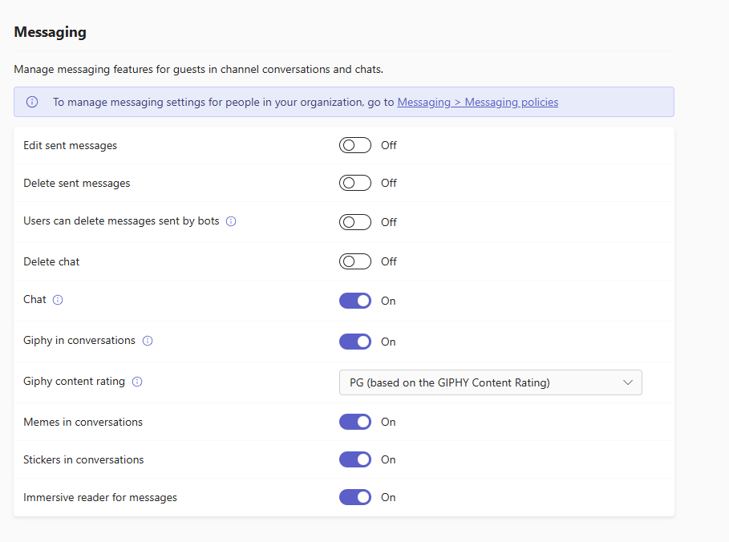

---

3. Meeting Policies (Org-wide Default)

I configured the Global (Org-wide default) meeting policy to enforce secure scheduling, control lobby behavior, and define content sharing and recording settings.

3.1 Meeting Scheduling

- Private meeting scheduling: On
- Channel meeting scheduling: On
- Meet now: On
- Meeting registration: On
- Who can register: Everyone
- Attendance engagement: On
- Attendee information: Show everything

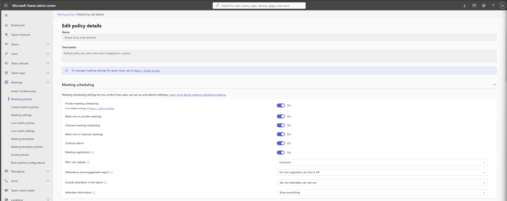

---

3.2 Meeting Join & Lobby

- Anonymous users joining: Off
- Anonymous joining after verifying email: By email code
- Anonymous users can start meeting: Off
- Who can bypass lobby: People in my org + guests
- Who can admit: Organizers & co-organizers
- Dial-in bypass lobby: Off
- Join external meetings: Anyone
- Verification check: Not required

3.3 Meeting Engagement

- Meeting chat: On for everyone
- Lobby chat between organizers & participants: On
- Q&A: On
- Reactions: On

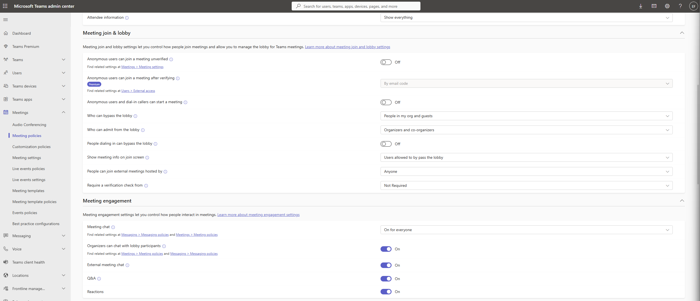

---

3.4 Content Sharing

- Who can present: Everyone
- Screen sharing: Entire screen
- Request/grant control: On (internal only)
- External control: Off
- PowerPoint Live: On
- Whiteboard: On
- Live share: On
- Shared notes: On

Premium:

- Restrict copying/forwarding chat: On
- Cross-tenant content sharing: Any org

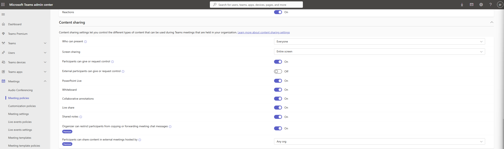

---

3.5 Recording & Transcription

- Meeting recording: On
- Participant agreement required: Off
- Store recordings outside region: Off
- Transcription: On
- Auto-expiration: On (120 days)
- Live captions: User-controlled
- Real-time text (RTT): On
- Copilot: On (with transcript required)

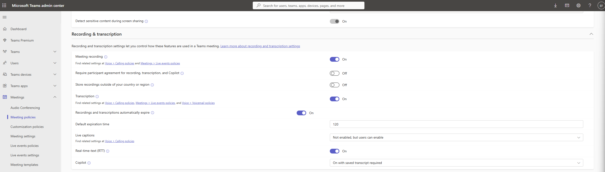

---

4. Live Events Policies

I enabled and configured global live event options.

Settings

- Live event scheduling: On
- Attendee transcription: On
- Who can join scheduled live events: Everyone in the organization
- Who can record: Organizer can record

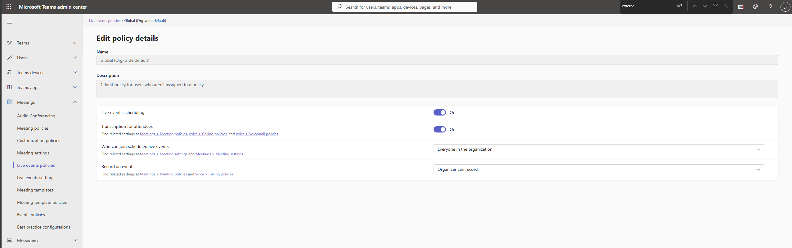

---

5. Teams Settings (Global Org-wide Default)
Teams creation & discovery

- Discover private teams: Off
- Create private/shared channels: On
- Shared channel external invitations: On

Notifications & Feeds

- Suggested feeds: On

Tagging

- Who can manage tags: Microsoft default
- Custom tags: On

Files (Storage Integrations)

All enabled:

- Citrix
- Dropbox
- Box
- Google Drive
- Egnyte

Organization

- Show org tab: On

Devices (Surface Hub)

- Authentication for content access: No access
- Set PIN: Required outside scheduled meetings
- Send emails: On

Search by name

- Scoped directory search: Off

Safety & Comms

- Role-based chat permissions: Off

Shared channels

- Support request link: Off

Network

- Use unified domain: Microsoft Default

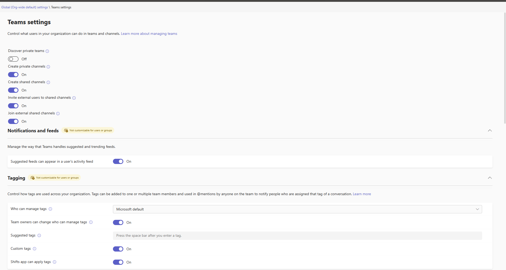

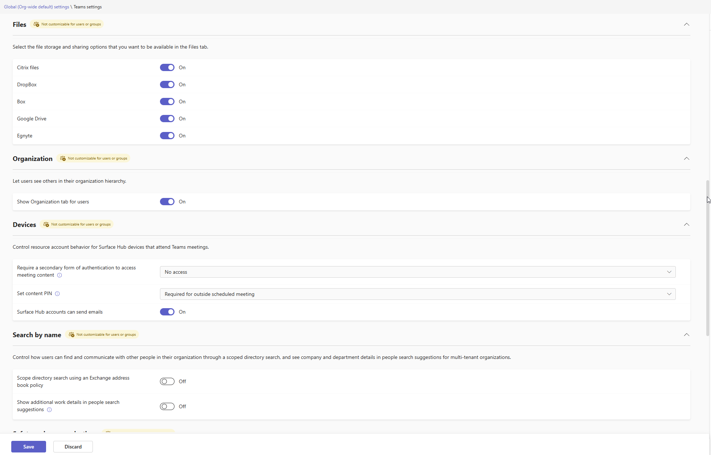

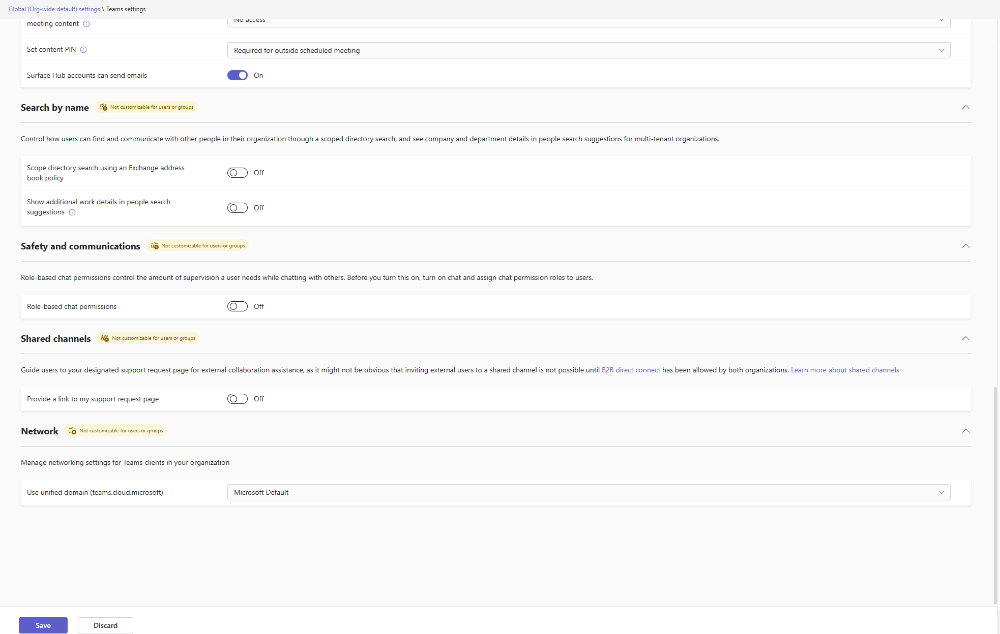

---

6. Teams Messaging Policies (Org-wide Default)
Messaging Controls

- Delete sent messages: Off
- Edit messages: On
- Read receipts: User controlled
- Custom emojis: Upload = On, Delete = Off
- Giphy / Memes / Stickers: On
- URL previews: On
- Report inappropriate content: On
- Translate messages: On
- Priority notifications: On
- Video messages: On
- Chat permissions role: Restricted
- Auto-share Loop content with external chats: Off

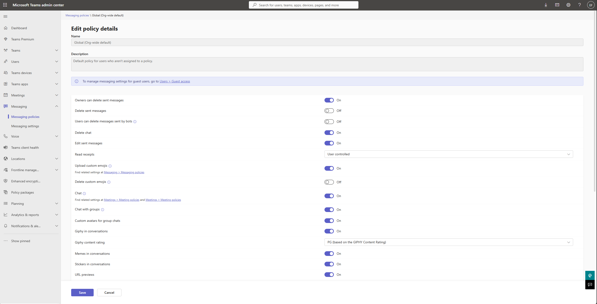

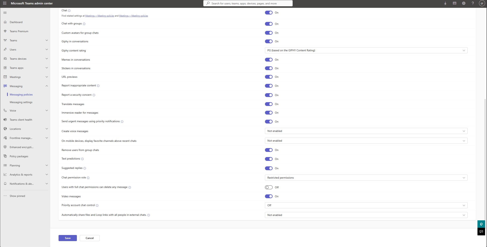

---

7. Teams Templates Policy (Standard Template Set)

I created a custom template policy to restrict which organizational templates users can select.

Visible templates

- Manage a Project
- Manage an Event
- Onboard Employees
- Adopt Office 365
- Organize Help Desk
- Incident Response

Hidden templates

- Remaining Microsoft defaults (Bank Branch, Retail, Volunteers, etc.)

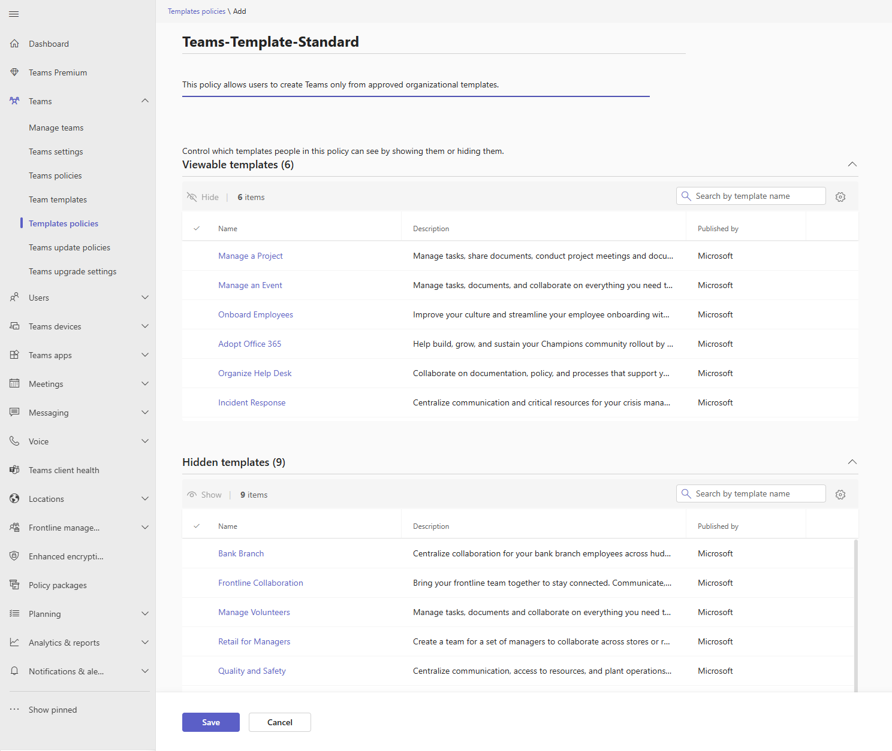

---

8. Teams Update Policies

Controls preview features and the transition to the new Teams client.

Settings

- Show Teams preview features: Off
- Use new Teams client: Microsoft controlled (default)

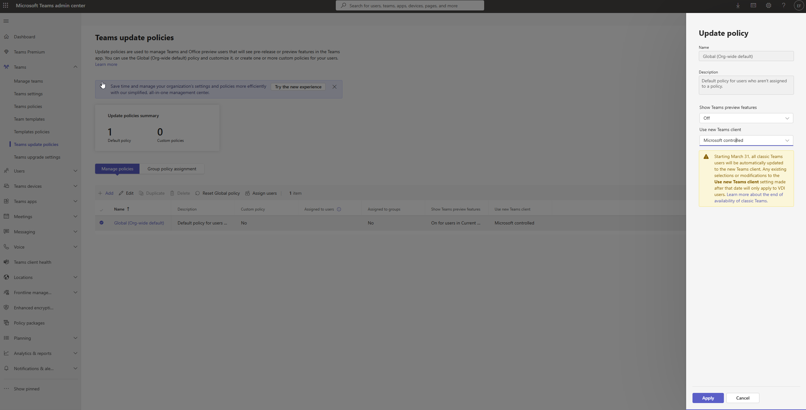

---

## 9. **Related reading**
   - For stronger governance and to ensure Teams creation remains controlled, I’ve also documented how I restrict Microsoft 365 Group creation. Since every Team creates an M365 Group, this is an important foundational step.
   - See also: [01-restrict-m365-group-creation.md](../scripts/01-restrict-m365-group-creation.md)
     
---

These security baselines configured, Teams is now governed, secure, and aligned with Microsoft 365 modern workplace best practices. These configurations ensure:

- Secure external collaboration
- Controlled guest capabilities
- Standardized meeting experience
- Enforced recording/transcription governance
- Consistent messaging & app usage
- Template-driven team creation
- Controlled rollout of Teams features

This completes the Teams Collaboration & Security hardening phase of my Modern Workplace & Microsoft Copilot project.
