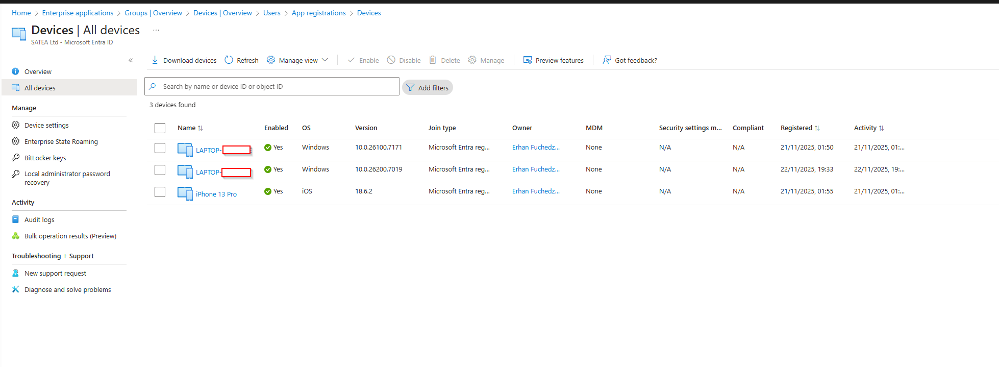
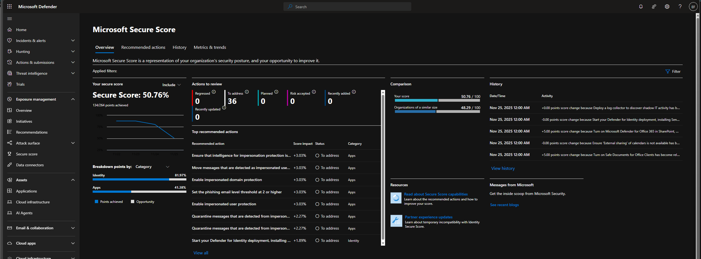
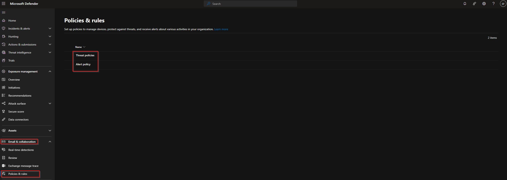
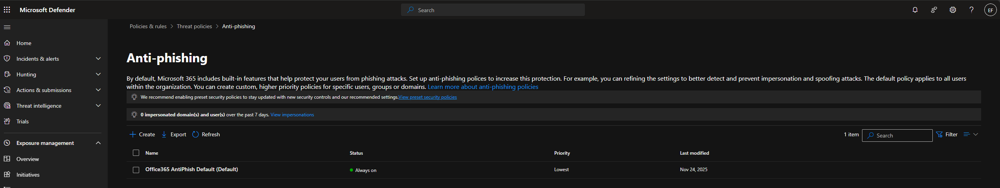

# 09 - Microsoft Defender & SOC

This folder documents my hands-on exploration of Microsoft Defender XDR, Secure Score, threat protection policies, and general SOC readiness using my own Microsoft 365 tenant. All screenshots included in this article were taken from my environment.

---

## 1. Architecture & Overview

In this lab, I focused on the core Microsoft Defender XDR components available in my license tier. My goal was to understand how Defender supports security operations, threat detection, and incident response.

Key areas explored:

- Identity protection (Entra ID)
- Device inventory & registration
- Email & collaboration threat policies
- Anti-malware & anti-phishing controls
- Secure Score recommendations
- Exposure management overview

Microsoft Defender XDR provides unified visibility across identity, email, devices, and cloud activity. Even without Defender for Office 365 Plan 2 or Sentinel, the platform delivers meaningful insights and baseline protections.

---

## 2. Identity & Device Inventory (Entra ID)

Device visibility is critical for SOC operations. I reviewed all devices joined or registered in Microsoft Entra ID, confirming OS version, join type, registration date, and activity.

---

This confirms that my Windows and iOS devices are correctly registered and monitored.

---

## 3. Microsoft Secure Score

Secure Score provides a data-driven security maturity model. It highlights opportunities to improve my environment’s identity, device, and app protection posture.

In my environment:

- Score: 50.76% (134/264 points)
- Identity security is relatively strong
- Application security has room for improvement
- Top recommendations include improving impersonation detection and phishing protection

Secure Score is especially important for small organizations because it prioritizes the most impactful actions.

---

## 4. Threat Protection Policies

Microsoft Defender provides policy-based controls for email and collaboration workloads. I reviewed the available policies in my tenant.

4.1 Policies & Rules Overview

The two major categories available are:

- Threat policies
- Alert policies

---

## 4.2 Anti-Malware

The default anti-malware policy is enabled and always active. It scans inbound and outbound email for malicious content and applies attachment filtering.

Screenshot: Anti-malware policy
(as included in the project)

Key points:

- “Always On”
- Baseline malware protection for all users

---

## 4.3 Anti-Phishing

Anti-phishing policies defend against:

User impersonation

Domain spoofing

High-confidence phishing attempts

The default policy applies to all users and is active.

Although advanced features require higher licensing, the core policy is still effective for small environments.

---

## 6. Summary

This lab demonstrates my practical experience with:

- Microsoft Defender XDR architecture
- Secure Score optimization
- Anti-malware and anti-phishing configuration
- Device visibility in Entra ID
- SOC-oriented analysis of Microsoft 365 security

