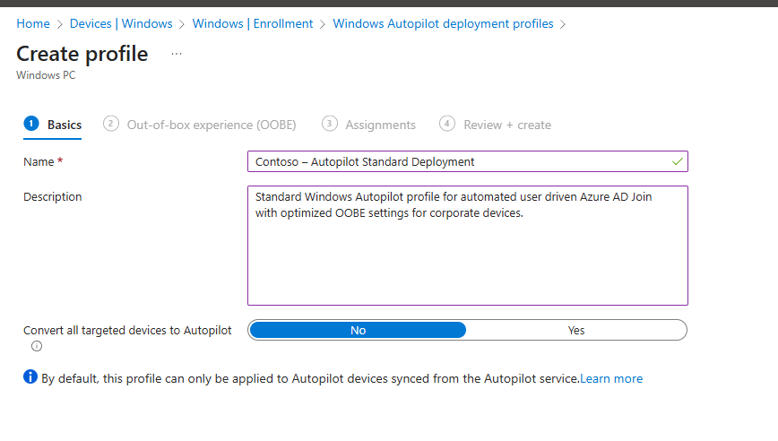
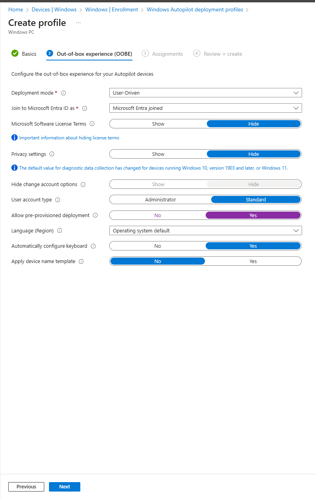
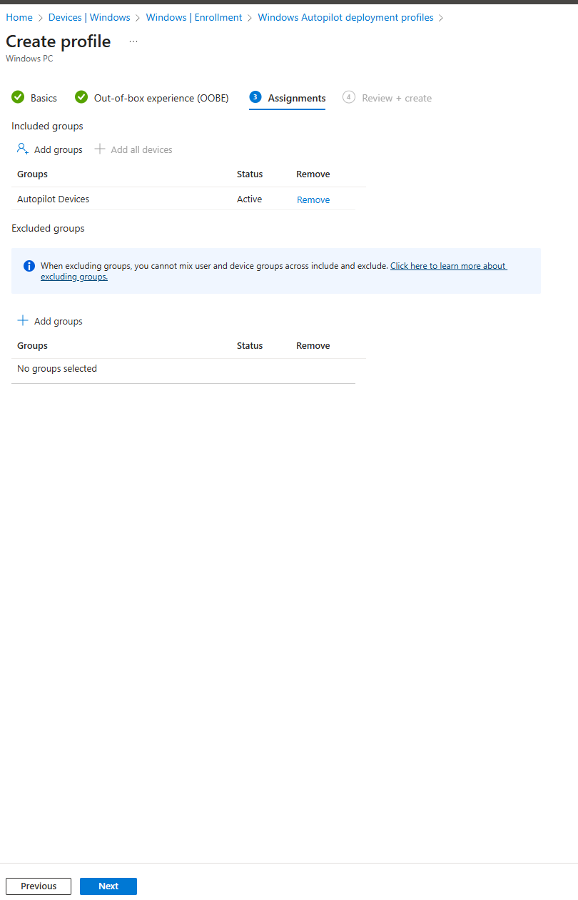
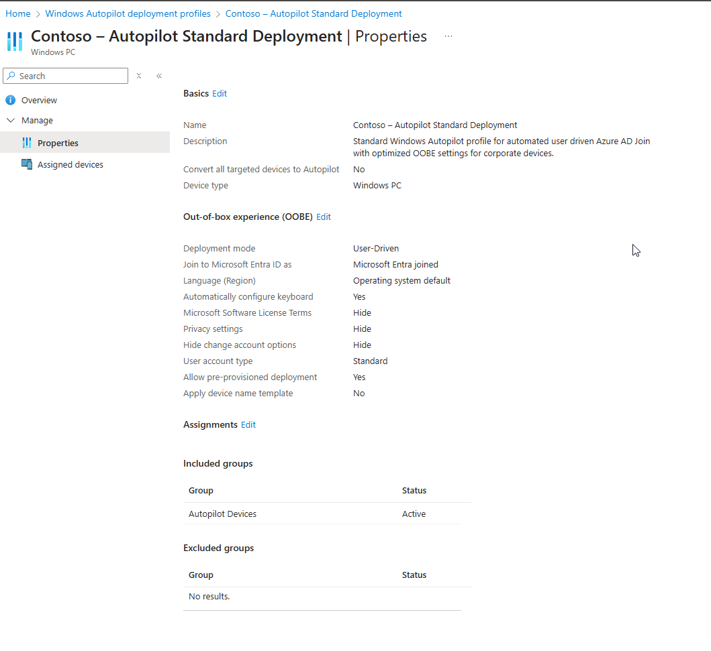

# 01 – Configure Windows Autopilot Deployment Profile

This article documents how I configured a standardized Windows Autopilot deployment profile for my Modern Workplace project. The goal is to ensure all corporate devices are deployed with a consistent, secure, and user-friendly out-of-box experience (OOBE).

## Overview

Windows Autopilot allows me to preconfigure and deploy Windows devices directly from the cloud.
In my Contoso tenant, I created a User-Driven Azure AD Joined Autopilot deployment profile with:

- Standardized OOBE
- Hidden privacy settings & license terms
- Automatic keyboard setup
- Pre-provisioned deployment support
- Assignment to the Autopilot Devices group

## Step 1 — Create a New Autopilot Profile

I started by navigating to:

Intune Admin Center → Devices → Windows → Enrollment → Windows Autopilot deployment profiles → Create profile

Basics Page

Name:
Contoso – Autopilot Standard Deployment

Description:
Standard Windows Autopilot profile for automated user driven Azure AD Join with optimized OOBE settings for corporate devices.

Convert all targeted devices to Autopilot: No

## Step 2 — Configure Out-of-Box Experience (OOBE)

The OOBE section controls what users see when first starting the device.

| Setting                          | Value                    |
| -------------------------------- | ------------------------ |
| Deployment mode                  | User-Driven              |
| Join to Microsoft Entra ID as    | Microsoft Entra joined   |
| Microsoft Software License Terms | Hide                     |
| Privacy settings                 | Hide                     |
| Hide change account options      | Hide                     |
| User account type                | Standard                 |
| Allow pre-provisioned deployment | Yes                      |
| Automatically configure keyboard | Yes                      |
| Apply device name template       | No                       |
| Language (Region)                | Operating system default |

This ensures users get a smooth sign-in experience with minimal interaction.

## Step 3 — Create an Autopilot Devices Group

To assign the profile correctly, I created a dedicated security group:

Microsoft Entra ID → Groups → New Group

| Field                            | Value                                                                       |
| -------------------------------- | --------------------------------------------------------------------------- |
| Group type                       | Security                                                                    |
| Group name                       | Autopilot Devices                                                           |
| Description                      | Devices that are imported or registered for Windows Autopilot provisioning. |
| Microsoft Entra roles assignable | No                                                                          |
| Membership type                  | Assigned                                                                    |

This group will host any device imported or synced to Autopilot.

## Step 4 — Assign the Autopilot Profile

Inside the deployment profile:

Assignments → Add groups → Autopilot Devices

This ensures only devices in the Autopilot Devices group receive the profile.

## Step 5 — Review & Create

I reviewed all settings and confirmed.

Then selected Create.

The profile is now active and ready for Autopilot devices.

## Final Result

I now have a standardized, secure Windows Autopilot deployment profile that:

- Enforces Azure AD Join
- Hides unnecessary setup screens
- Configures user accounts as Standard
- Supports pre-provisioned deployments
- Automatically applies to all assigned Autopilot devices

This creates the foundation for a consistent device provisioning experience in my Modern Workplace environment.

