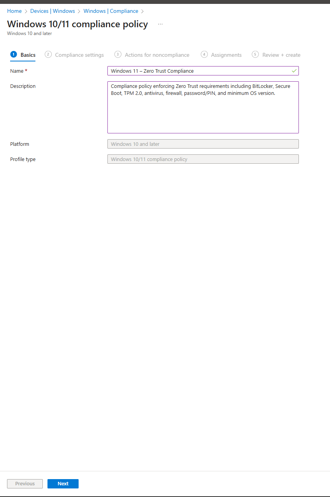
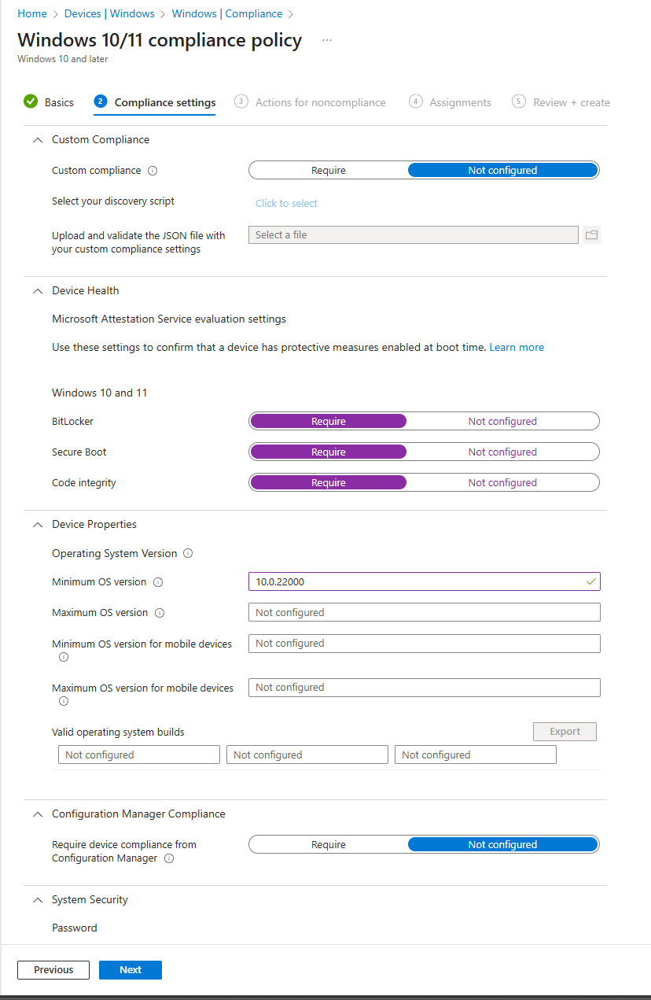
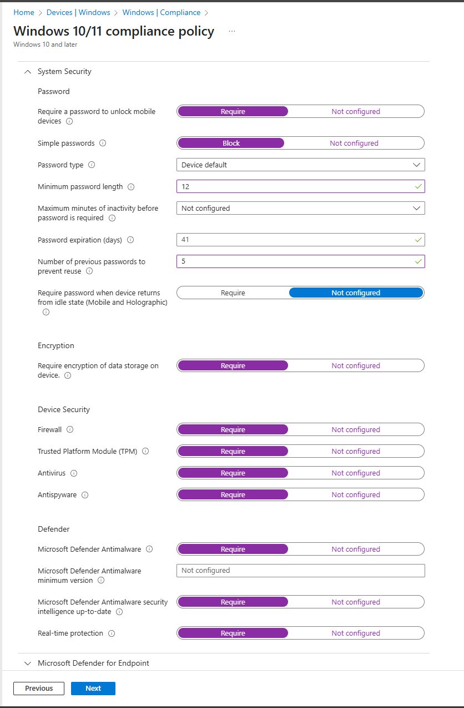
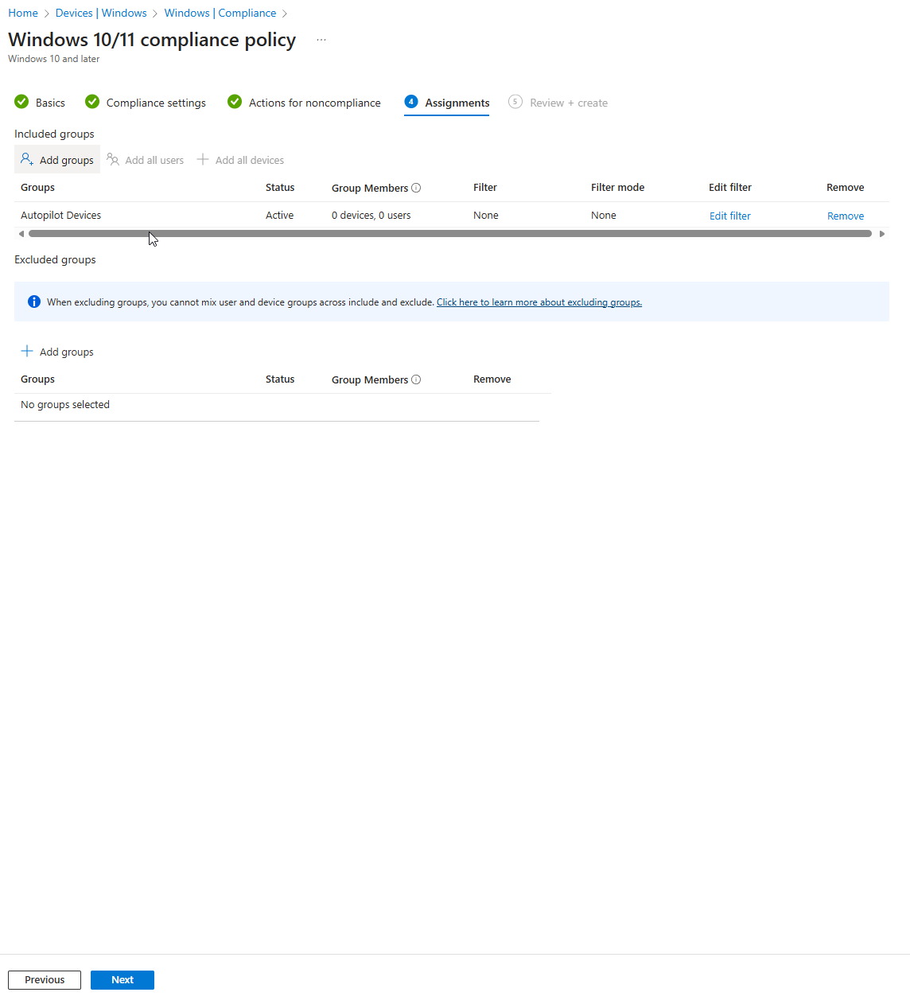
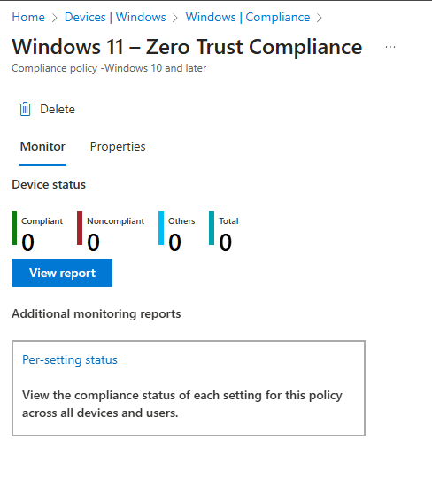

# 02 – Windows 11 Compliance Policy (Zero Trust Requirement)

In my Modern Workplace environment, I enforce a strict Windows 10/11 compliance policy to make sure only secure, trusted, and fully protected devices can access corporate data.
This policy works hand-in-hand with Conditional Access, where apps like Exchange Online, Teams, and SharePoint require a compliant device before granting access.

## 1.Compliance Policy Overview

To build a Zero Trust foundation, I configure a Windows 10/11 compliance policy in Microsoft Intune.
This ensures that every device enrolled meets mandatory security requirements before it is considered trusted.

## 2.Compliance Settings (Zero Trust Requirements)

My Windows 11 compliance policy enforces strict security baselines aligned with Zero Trust principles.
Based on the screenshots, the following core requirements are configured:

Device Health: 

- BitLocker → Require
- Secure Boot → Require
- Code Integrity → Require

Device Properties:

- Minimum OS Version → 10.0.22000 (Windows 11)
This ensures only Windows 11 devices meet compliance.

System Security

- Require a password to unlock the device
- Block simple passwords
- Minimum length: 12 characters
- Password expiration: 41 days
- Password history: 5 passwords

Encryption & Security Tools

- Require encryption of data storage (BitLocker)
- Require TPM 2.0
- Require Firewall enabled
- Require Antivirus enabled
- Require Antispyware enabled
- Require Microsoft Defender Antimalware
- Require real-time protection
- Defender security intelligence must be up-to-date

These settings ensure devices meet strong Zero Trust readiness standards.

## 3.Assignments

I assign the compliance policy to my Autopilot and corporate Windows device groups.
This ensures all enterprise-managed devices must follow these security restrictions.

## 4.Monitoring Compliance

After the policy is deployed, I monitor compliance to ensure devices meet all requirements.
Noncompliant devices are blocked from accessing corporate apps until they remediate issues.

## Conclusion

By enforcing this Windows 11 Zero Trust Compliance Policy, I make sure every device accessing Microsoft 365 workloads meets strict security baselines.
Combined with Conditional Access, this architecture significantly strengthens my Modern Workplace security posture and reduces risk across the environment.
