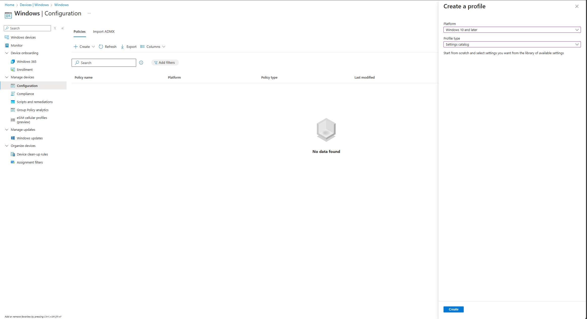
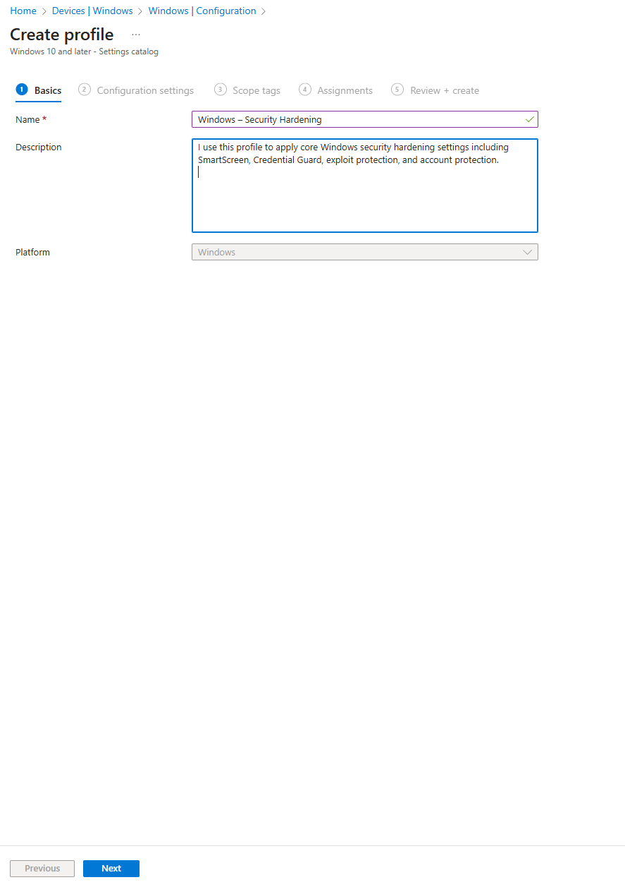
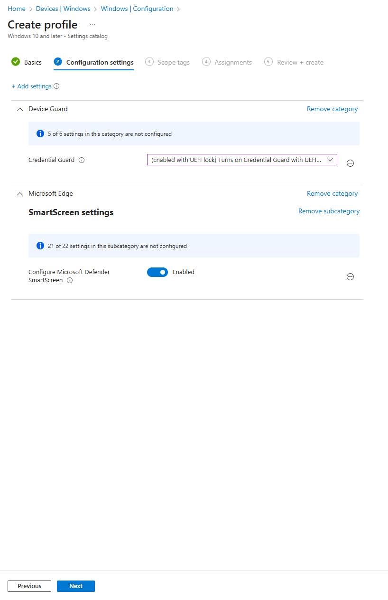
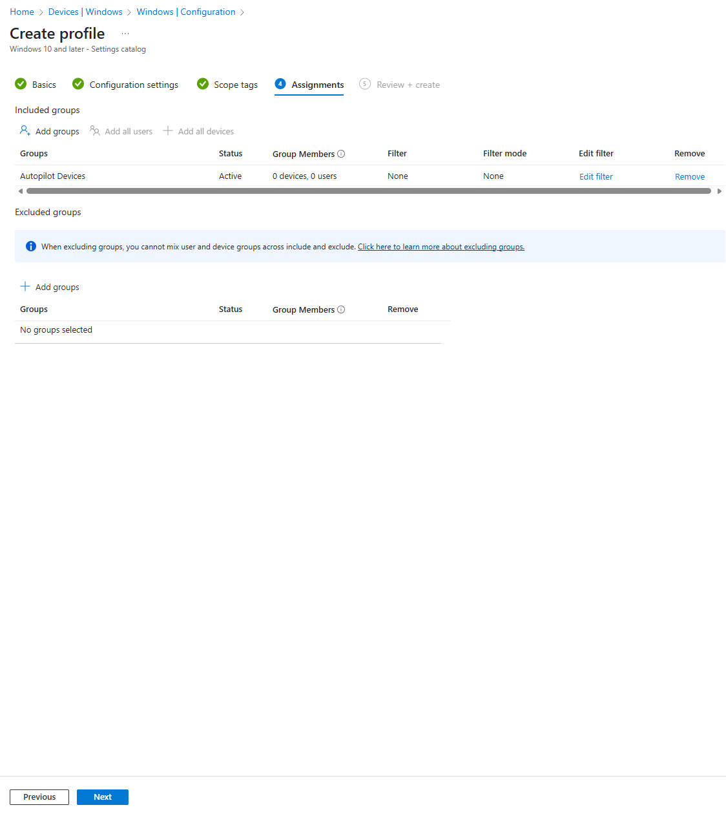
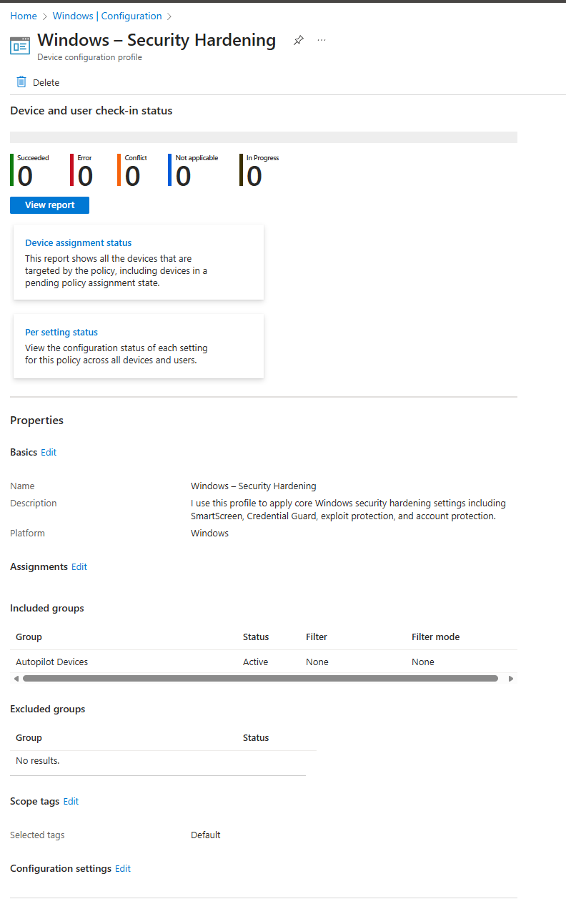

# 03. Configuration Profiles

In my Modern Workplace environment, I use Intune configuration profiles to enforce security, productivity, and governance settings across all Windows devices.  
These profiles help me apply Zero Trust principles and ensure every device follows my security baselines.

## 1. Configuration Profiles Overview

Configuration profiles allow me to apply Windows settings directly through Intune without using group policies.  
I use them to manage security, update settings, device restrictions, browser policies, and more.

---

## 2. Creating My Windows Security Hardening Profile

This is one of my core profiles.  
I use it to enforce Windows Defender SmartScreen and Credential Guard during device enrollment.

### Step 1 — Create a new profile

I start by creating a new **Settings catalog** profile:

- **Platform:** Windows 10 and later  
- **Profile type:** Settings catalog  

---

### Step 2 — Basics

I give the profile a meaningful name and description:

- **Name:** Windows – Security Hardening  
- **Description:** I use this profile to apply core Windows security hardening settings including SmartScreen, Credential Guard, exploit protection, and account protection.

---

### Step 3 — Configuration Settings

I add the following settings:

### Credential Guard  
- Enabled with UEFI Lock

### SmartScreen  
- Configure Microsoft Defender SmartScreen → **Enabled**

---

### Step 4 — Assignments

I assign the profile to **Autopilot Devices**, ensuring that every new corporate device receives these protections during provisioning.

---

### Step 5 — Final Profile

After creation, the profile shows correctly in Intune with the appropriate assignments and settings.

## Conclusion
With my first configuration profile in place — Windows Security Hardening — I have established the baseline protections required for my Zero Trust Modern Workplace.
This profile enables core Windows security features such as Credential Guard and Microsoft Defender SmartScreen, ensuring every Autopilot device starts with strong built-in protection from the moment it enrolls.

