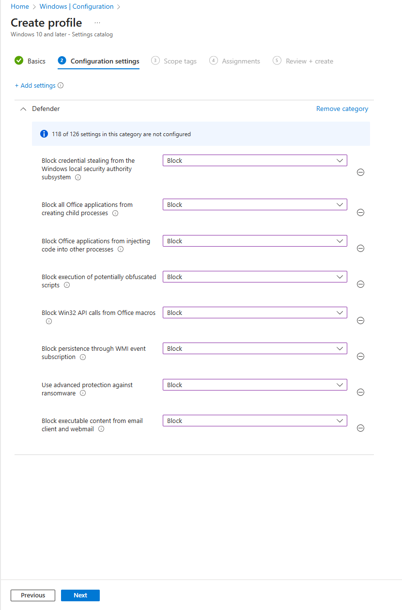
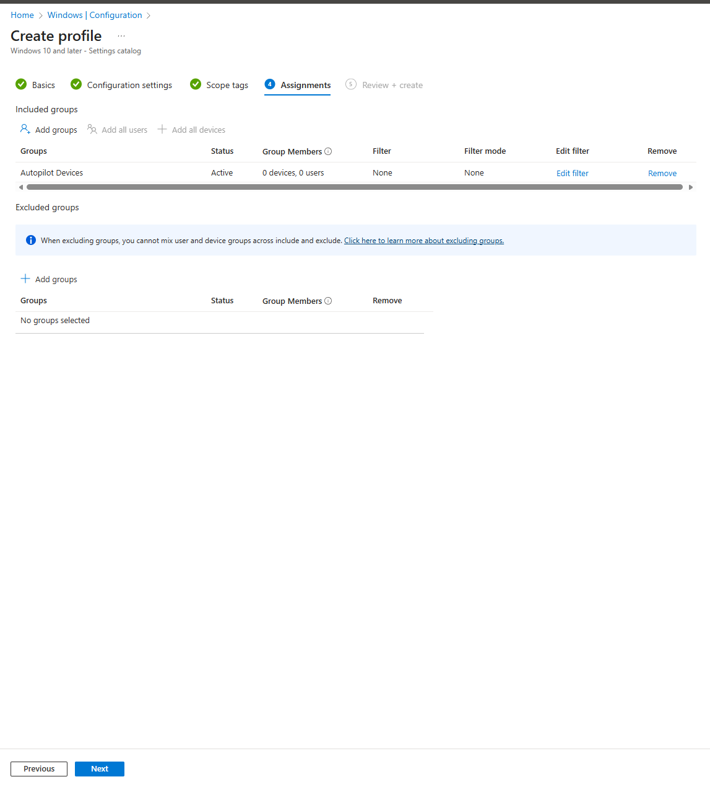
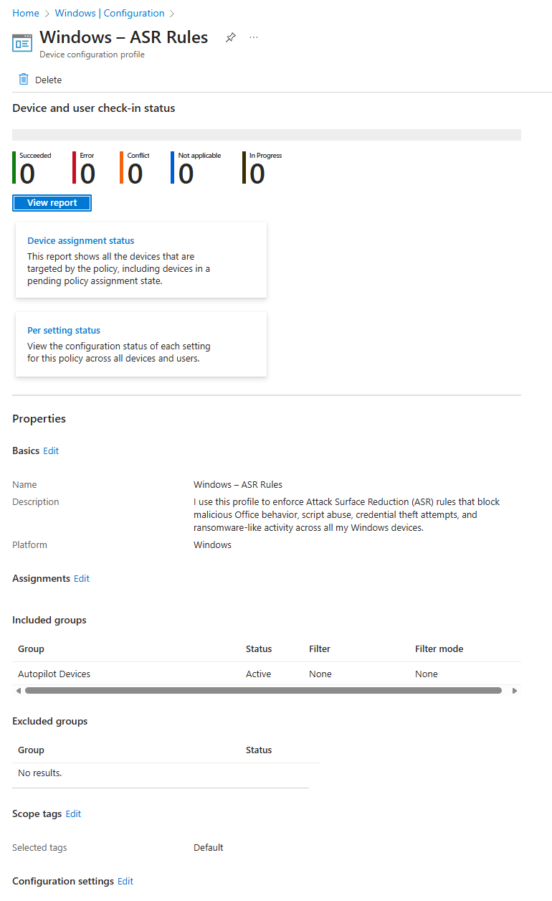

# 03.04.01 — Attack Surface Reduction (ASR)

In my Modern Workplace environment, I enforce Attack Surface Reduction (ASR) rules to block malicious behavior such as ransomware, script abuse, credential theft, and risky Office macro activity.
ASR is a critical part of my Zero Trust device security model and strengthens endpoint protection even before Defender for Endpoint is fully deployed.

---

## 1. Why I use ASR rules

I rely on ASR rules to:

- Block malicious Office macro behavior
- Stop credential theft attempts against LSASS
- Prevent script-based attacks (PowerShell, JS, VBS)
- Reduce ransomware-like activity
- Limit unauthorized code execution
- Protect users from email-based threats

These rules dramatically reduce the attack surface on all my Windows devices.

---

## 2. Creating my ASR configuration profile

### Step 1 — Create a new Settings Catalog profile

I begin by creating a new Intune configuration profile using the Settings Catalog for Windows 10 and later.

---

### Step 2 — Profile basics

I configure the basic information:

- **Name:** Windows – ASR Rules  
- **Description:** I use this profile to enforce Attack Surface Reduction (ASR) rules that block malicious Office behavior, script abuse, credential theft attempts, and ransomware-like activity across all my Windows devices.

---

### Step 3 — Add ASR rules in Settings Catalog

I add the following ASR settings:

### 🔐 Required ASR Rules I enable:

| ASR Rule                                        | Setting   |
| ----------------------------------------------- | --------- |
| Block credential stealing from LSASS            | **Block** |
| Block Office apps from creating child processes | **Block** |
| Block Office apps from injecting code           | **Block** |
| Block potentially obfuscated scripts            | **Block** |
| Block Win32 API calls from Office macros        | **Block** |
| Block executable content from email/webmail     | **Block** |
| Block persistence via WMI event subscription    | **Block** |
| Use advanced ransomware protection              | **Block** |

This ensures high protection against Office-based attacks, scripting abuse, and credential harvesting.

---

### Step 4 — Assign profile to devices

I assign this profile to my Autopilot Devices group so that every newly provisioned Windows device immediately receives ASR protections.

---

### Step 5 — Final ASR profile in Intune

Once created, I verify the profile and confirm that it is assigned correctly.

---

## 3. Result

By enabling ASR rules, I significantly reduce the attack surface of my Windows devices.  
These controls prevent real-world threats such as ransomware, malicious VBA macro attacks, script abuse, and credential theft attempts.

ASR is a core part of my Zero Trust protection strategy and complements my other configuration profiles such as Security Hardening, OneDrive KFM, Device Restrictions, and Edge browser policies.

