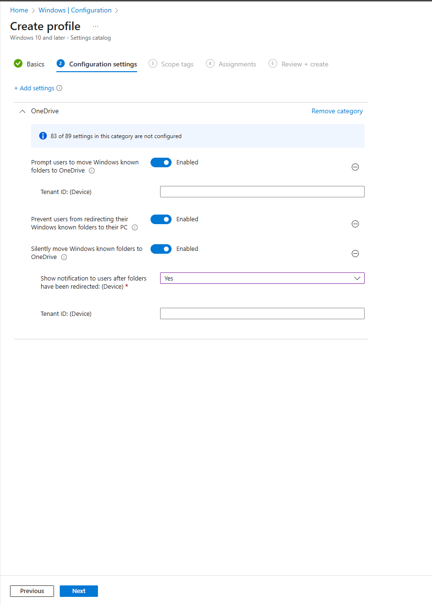
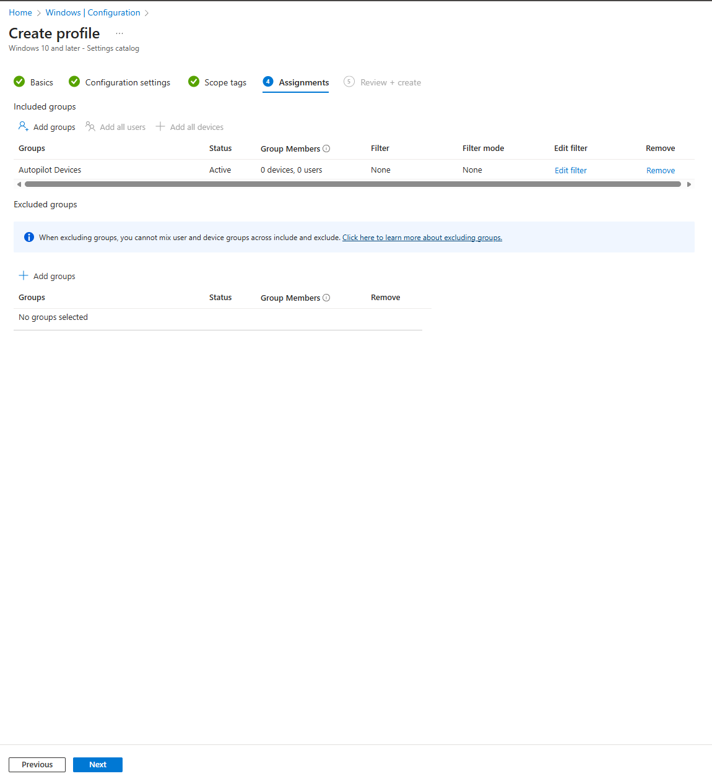

# 05 – OneDrive Known Folder Move (KFM)

In my Modern Workplace setup, I use OneDrive Known Folder Move (KFM) to automatically protect user data by redirecting Desktop, Documents, and Pictures into OneDrive.
By redirecting Desktop, Documents, and Pictures to OneDrive, I remove the risk of users saving important files only on their local machines.

---

## 1. Why I use OneDrive KFM

I rely on KFM to:

- Automatically back up key user folders (Desktop, Documents, Pictures)
- Protect user data against device loss, theft, or hardware failure
- Enable a seamless experience when users move to a new device
- Support my cloud-first, Zero Trust design where data lives in Microsoft 365

This configuration ensures that user content follows the account, not the device.

---

## 2. Creating my OneDrive KFM configuration profile

I manage KFM using an Intune configuration profile based on the **Settings catalog**.

### Step 1 – Profile basics

I create a new profile with:

- **Platform:** Windows 10 and later  
- **Profile type:** Settings catalog  
- **Name:** Windows – OneDrive Known Folder Move (KFM)  
- **Description:** I use this profile to automatically redirect Desktop, Documents, and Pictures to OneDrive using Known Folder Move (KFM). This ensures all user data is synced, protected, and available across devices.

.png)
---

## 3. Configuring OneDrive KFM settings

Next, I add the **OneDrive** category from the Settings catalog and enable the key KFM policies.

I configure:

- **Prompt users to move Windows known folders to OneDrive** → Enabled  
- **Prevent users from redirecting their Windows known folders to their PC** → Enabled  
- **Silently move Windows known folders to OneDrive** → Enabled  
- **Show notification to users after folders have been redirected** → Yes  

These settings ensure that Known Folders are redirected to OneDrive and stay there.

---

## 4. Assigning KFM to my devices

I assign the profile to my **Autopilot Devices** group so every new corporate device gets KFM automatically during enrollment.

This guarantees that as soon as a device is provisioned with Autopilot, user folders start syncing to OneDrive without manual configuration.

---

## 5. Result in Intune

After creating the profile, I verify it in Intune to confirm:

- The **name and description** are correct  
- The **Autopilot Devices** group is included  
- Scope tags remain at **Default**  
- The configuration settings reflect my KFM policy

.png)

---

## 6. Outcome

With OneDrive KFM configured through Intune, I ensure that:

- User data is always stored in OneDrive instead of only on local disks  
- Device replacement or Autopilot reprovisioning is seamless for end users  
- My Modern Workplace environment follows a cloud-first, data-centric security model

This KFM profile works together with my other configuration profiles (Security Hardening, ASR, Device Restrictions, and Edge policies) to provide a secure and resilient experience for all Windows devices.
