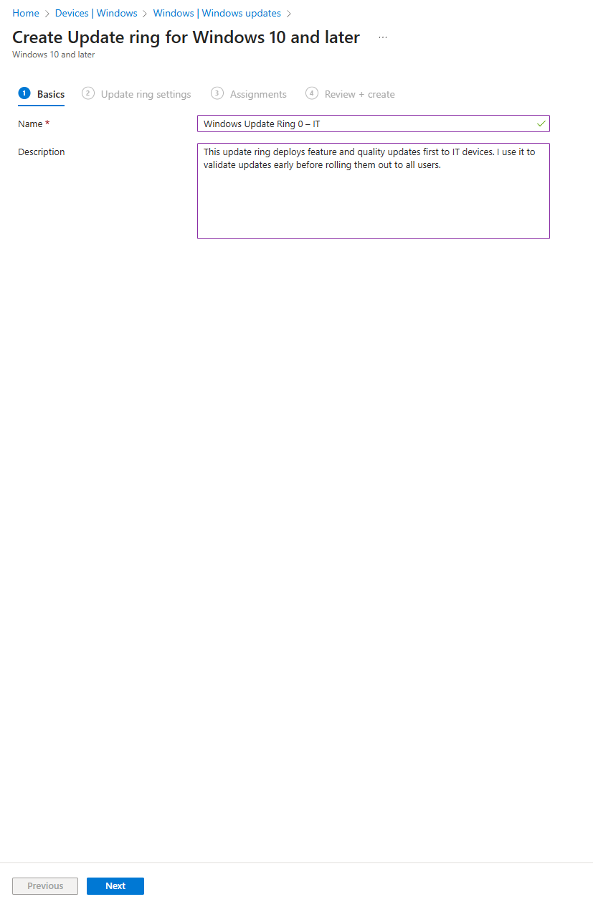
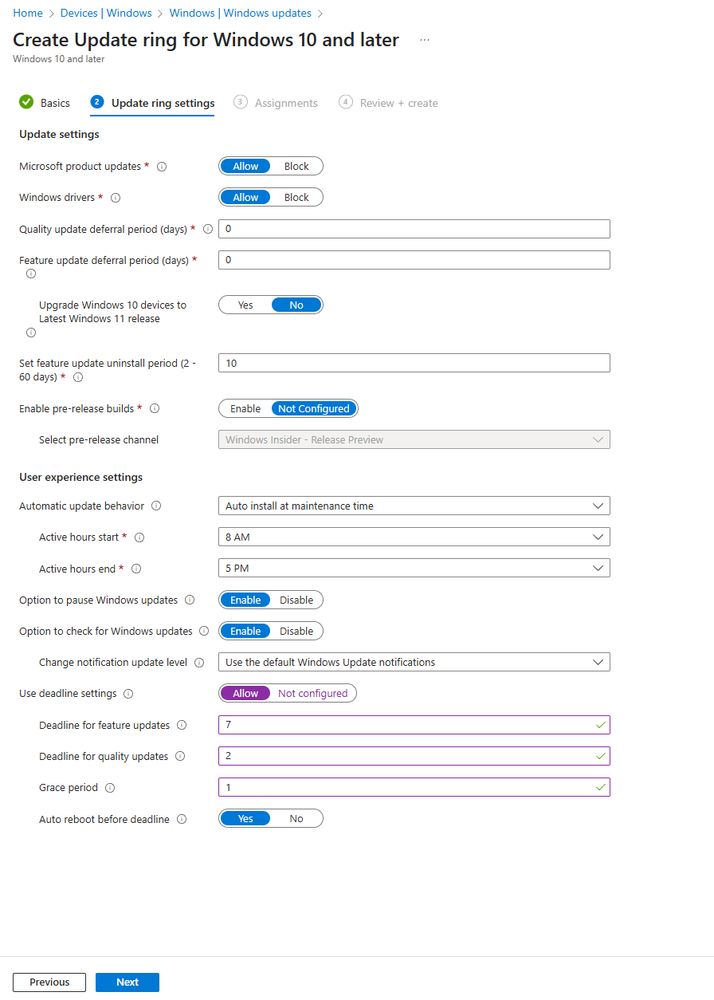
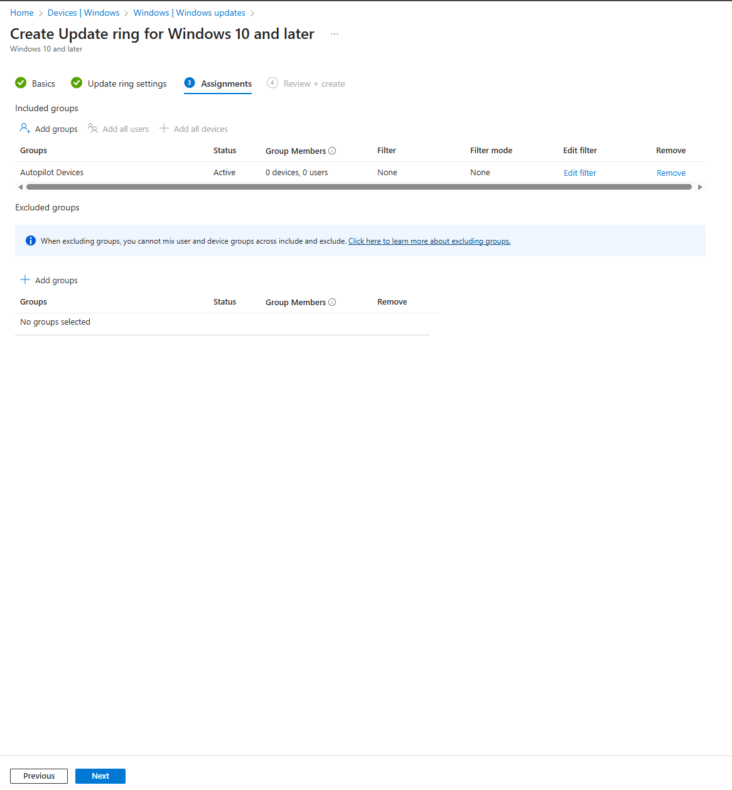
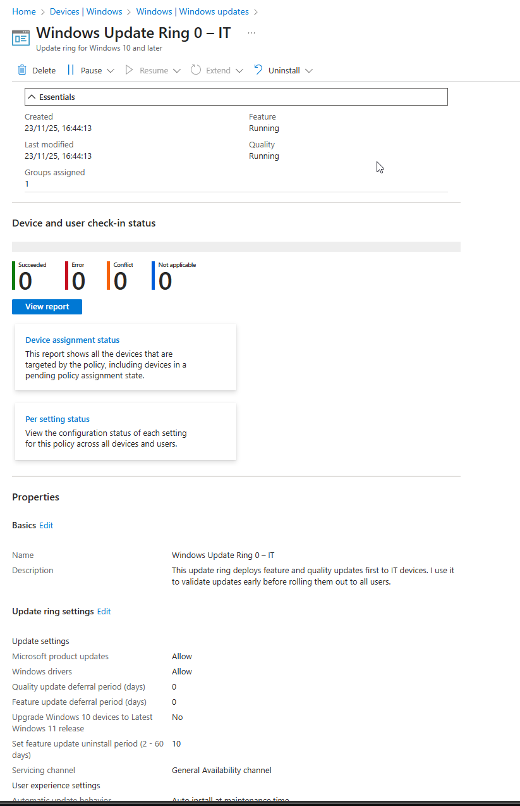
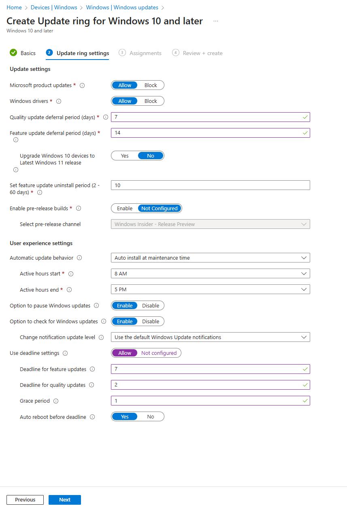
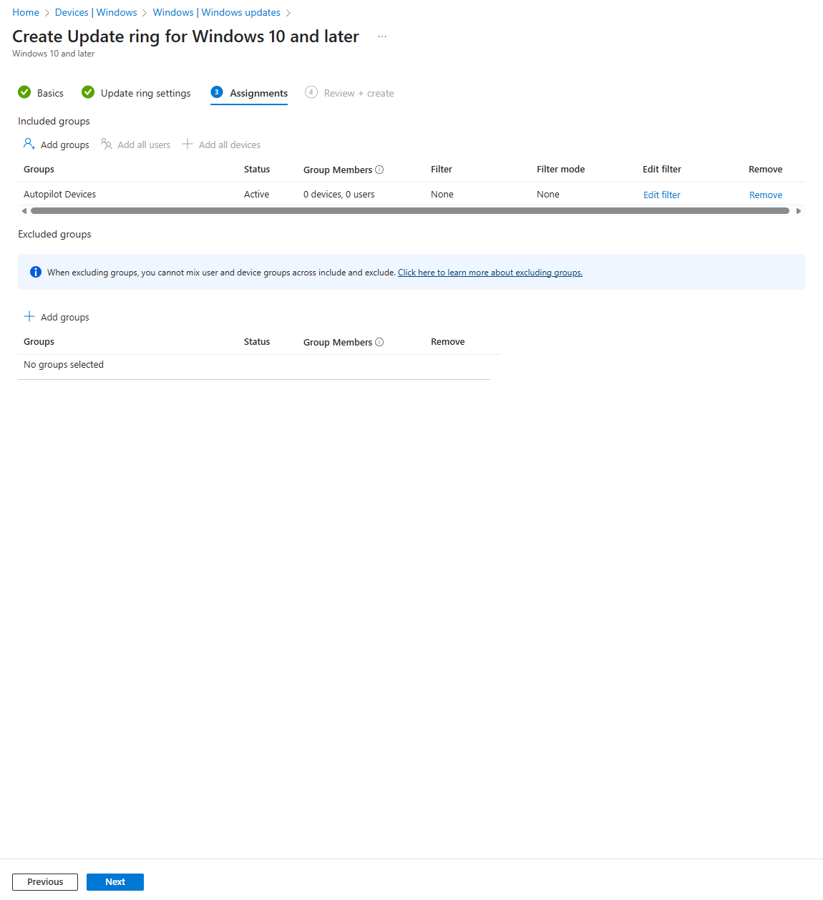
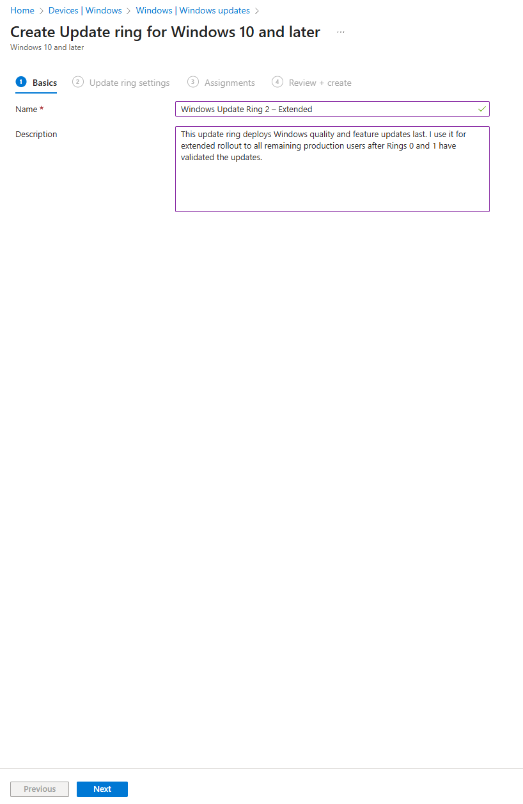
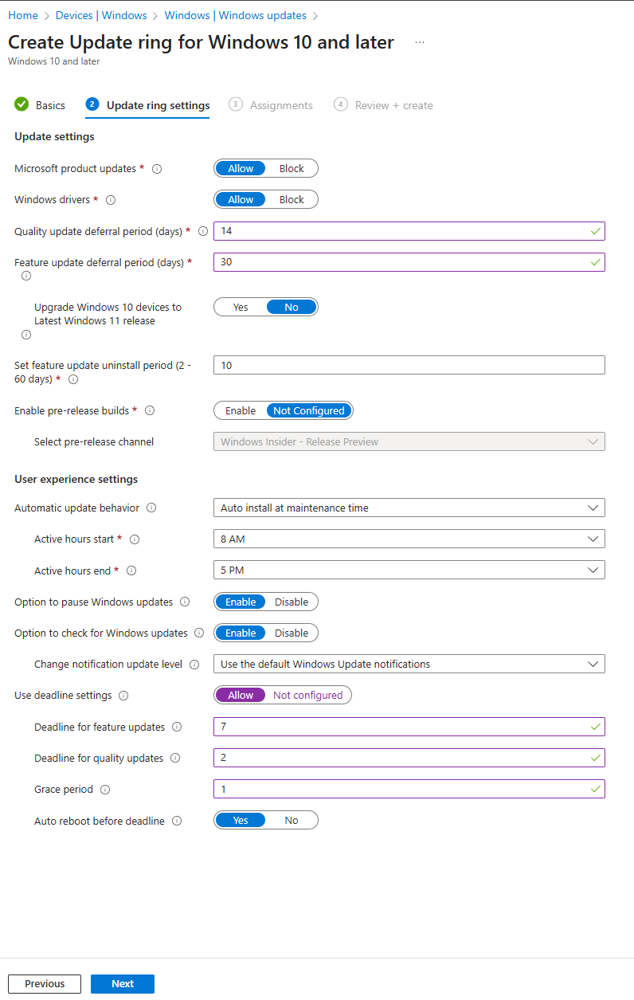
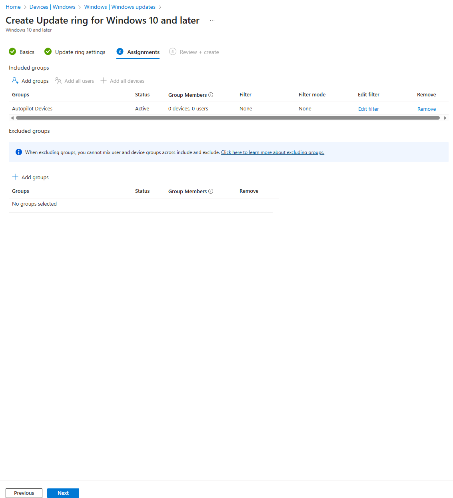
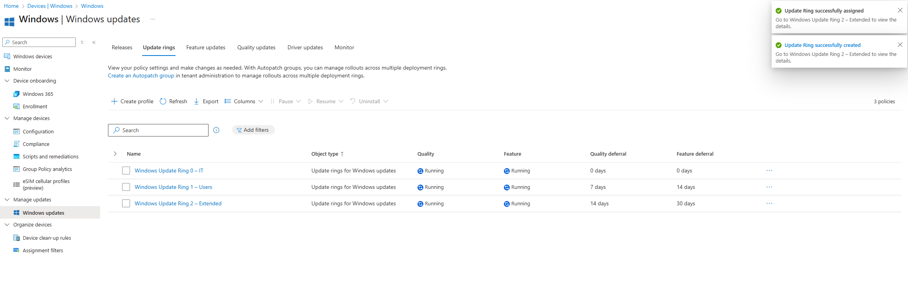

# 06 — Windows Update Rings (Windows Update for Business)

In my Modern Workplace environment, I use Windows Update for Business (WUfB) with update rings to control how Windows updates are rolled out to devices.

Instead of letting every device update at the same time, I use staged rings:

- **Ring 0 – IT:** early validation on IT/admin devices  
- **Ring 1 – Users:** standard production rollout  
- **Ring 2 – Extended:** final rollout for devices that need extra stability  

This gives me predictable rollouts, faster detection of issues, and a safer update experience for all users.

---
 
## 1. My Windows Update ring strategy

I use three rings with different **deferral periods**:

| Ring | Target devices | Quality deferral | Feature deferral |
|------|----------------|------------------|------------------|
| **Ring 0 – IT** | IT/admin and test devices | 0 days | 0 days |
| **Ring 1 – Users** | Standard production users | 7 days | 14 days |
| **Ring 2 – Extended** | Remaining / less critical devices | 14 days | 30 days |

All rings share the same:

- Active hours (8 AM – 5 PM)  
- Automatic update behavior (auto install at maintenance time)  
- Deadlines (7 days for feature updates, 2 days for quality updates, 1-day grace, auto reboot before deadline)

---

## 2. Windows Update Ring 0 – IT

Ring 0 is where I validate updates first. Only IT and admin machines are in this ring, so I can catch issues before they affect end users.

### 2.1 Create the Ring 0 profile

In Intune I go to:

> **Devices → Windows → Windows updates → Update rings**

I create a new profile for **Windows 10 and later**.

- **Name:** `Windows Update Ring 0 – IT`  
- **Description:** I use this ring to deploy feature and quality updates first to IT devices and validate them before rolling out to all users.

---

### 2.2 Ring 0 settings

For Ring 0 I configure:

- **Microsoft product updates:** Allow  
- **Windows drivers:** Allow  
- **Quality update deferral (days):** `0`  
- **Feature update deferral (days):** `0`  
- **Upgrade to latest Windows 11 release:** No  
- **Feature update uninstall period (days):** `10`  
- **Pre-release builds:** Not configured  

User experience:

- **Automatic update behavior:** Auto install at maintenance time  
- **Active hours:** 8 AM – 5 PM  
- **Pause updates:** Enable  
- **Check for updates:** Enable  
- **Notification level:** Default  

Deadlines:

- **Use deadline settings:** Allow  
- **Deadline for feature updates:** `7`  
- **Deadline for quality updates:** `2`  
- **Grace period:** `1`  
- **Auto reboot before deadline:** Yes  

---

### 2.3 Ring 0 assignments

I assign the profile to my IT device group.

---

### 2.4 Ring 0 result

After creation I can see the Ring 0 policy running and linked to my IT group.

Ring 0 gives me an early-warning layer. If an update causes problems, I can pause or adjust before it reaches standard users.

---

## 3. Windows Update Ring 1 – Users

Ring 1 is my **main production ring**. Once updates are validated on Ring 0, they roll out here with moderate deferrals.

### 3.1 Create the Ring 1 profile

I create another **Windows 10 and later – Update ring** profile.

- **Name:** `Windows Update Ring 1 – Users`  
- **Description:** I use this ring to deploy feature and quality updates to standard users after they have been validated in Ring 0, with moderate deferral periods.
  

---

### 3.2 Ring 1 settings

For Ring 1 I use slightly longer deferrals:

- **Microsoft product updates:** Allow  
- **Windows drivers:** Allow  
- **Quality update deferral (days):** `7`  
- **Feature update deferral (days):** `14`  
- **Upgrade to latest Windows 11 release:** No  
- **Feature update uninstall period (days):** `10`  
- **Pre-release builds:** Not configured  

User experience and deadline settings are the same as Ring 0:

- **Automatic update behavior:** Auto install at maintenance time  
- **Active hours:** 8 AM – 5 PM  
- **Pause / Check for updates:** Enabled  
- **Notification level:** Default  
- **Feature deadline:** `7` days  
- **Quality deadline:** `2` days  
- **Grace period:** `1` day  
- **Auto reboot before deadline:** Yes  

---

### 3.3 Ring 1 assignments

I assign this ring to my **Autopilot Devices** / standard user devices so they receive updates after IT has validated them.

---

### 3.4 Ring 1 result

In the console I can see:

- Ring 0 – IT (0 / 0 days deferral)  
- Ring 1 – Users (7 / 14 days deferral)

Ring 1 is where most of my estate lives, so stability and predictable rollout timings are critical.

---

## 4. Windows Update Ring 2 – Extended

Ring 2 is my **extended rollout** ring. I use it for devices that need extra stability or where updates can be delayed further (for example, lab machines or low-priority devices).

### 4.1 Create the Ring 2 profile

I create a third **Windows 10 and later – Update ring** profile.

- **Name:** `Windows Update Ring 2 – Extended`  
- **Description:** I use this ring for extended rollout to remaining production users after Rings 0 and 1 have validated the updates.
  

---

### 4.2 Ring 2 settings

For Ring 2 I apply the longest deferrals:

- **Microsoft product updates:** Allow  
- **Windows drivers:** Allow  
- **Quality update deferral (days):** `14`  
- **Feature update deferral (days):** `30`  
- **Upgrade to latest Windows 11 release:** No  
- **Feature update uninstall period (days):** `10`  
- **Pre-release builds:** Not configured  

User experience and deadline settings stay the same (8–5 active hours, 7/2/1 deadlines with auto reboot).

---

### 4.3 Ring 2 assignments

I assign Ring 2 to my final / extended device group.

---

### 4.4 Ring 2 result

Once created, I can see all three rings:

- Windows Update Ring 0 – IT  
- Windows Update Ring 1 – Users  
- Windows Update Ring 2 – Extended  

Each ring shows its quality and feature deferral values.

---

## 5. Result

With these three update rings in place, I have a **staged Windows Update for Business model**:

1. **Ring 0 – IT** catches issues early.  
2. **Ring 1 – Users** receives validated updates with moderate delays.  
3. **Ring 2 – Extended** gets updates last, providing maximum stability where needed.

This structure gives me:

- Safer rollout of Windows updates  
- Better control over feature releases  
- Reduced risk of widespread issues  
- A clean, well-documented update strategy for my Modern Workplace environment.
