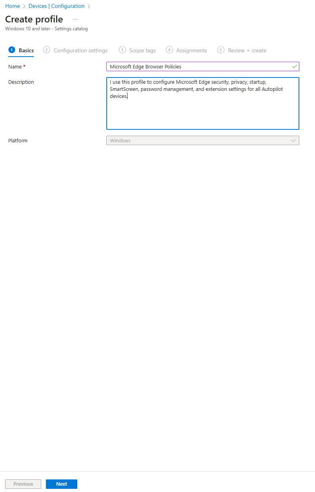
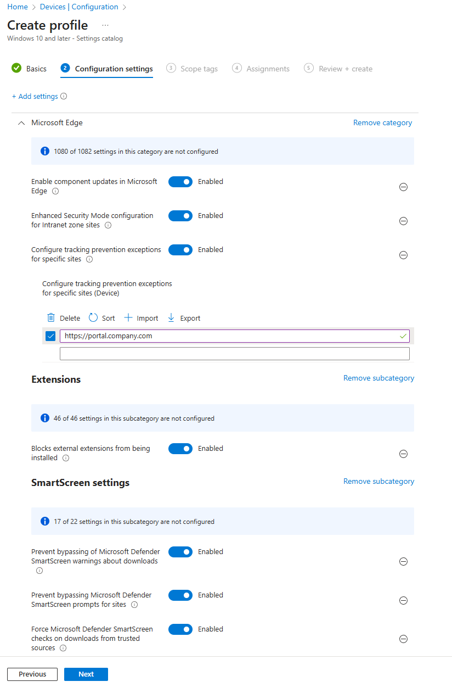
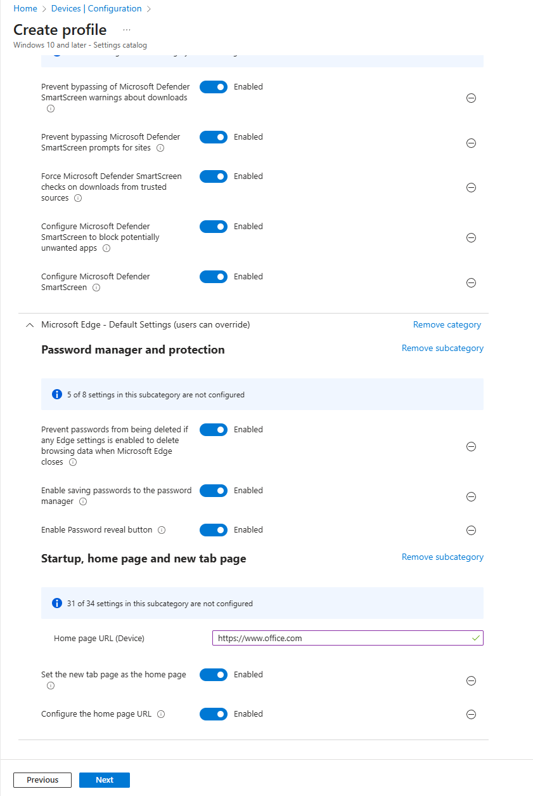
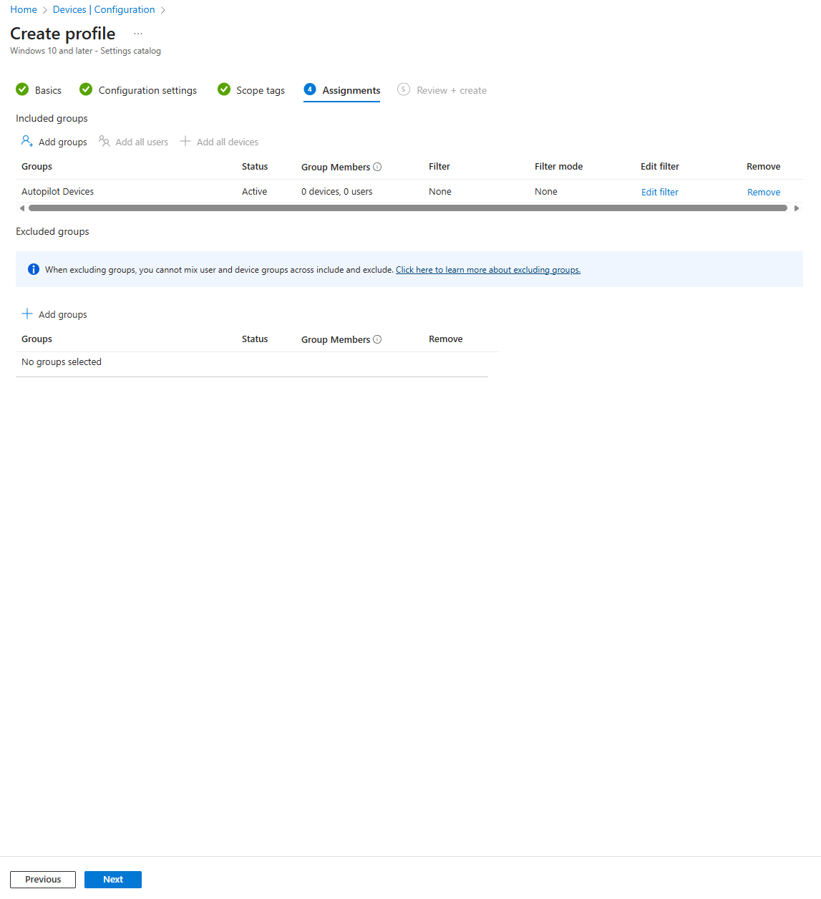
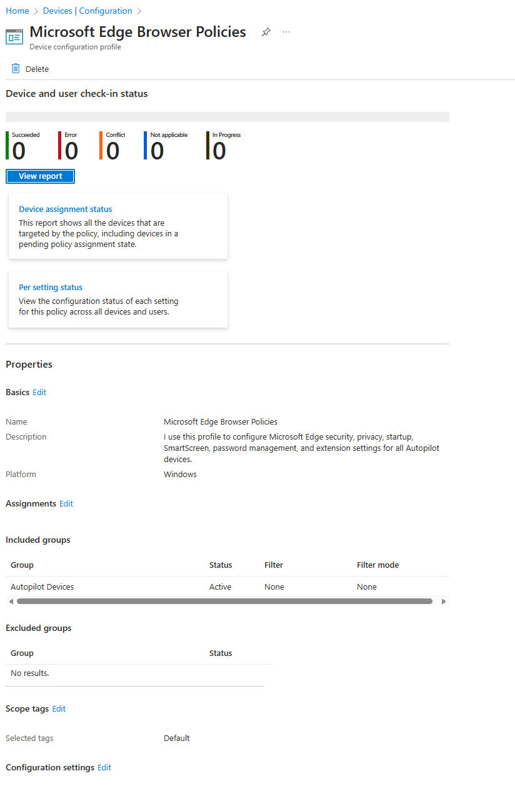

# 07 - Microsoft Edge Browser Policies – Intune Configuration

This article documents how I configured Microsoft Edge browser policies in Intune as part of my Modern Workplace setup.  
The goal of this profile is to apply essential Edge security, privacy, SmartScreen, password, and extension settings on all Autopilot-managed Windows devices.

---

## 1️. Create the Configuration Profile

In Intune, navigate to:

**Devices → Configuration → Create profile**

- **Platform:** Windows 10 and later  
- **Profile type:** Settings catalog  
- **Name:** *Microsoft Edge Browser Policies*  
- **Description:**  
  *I use this profile to configure Microsoft Edge security, privacy, startup, SmartScreen, password management, and extension settings for all Autopilot devices.*

Click **Next**.

---

## 2️. Configuration Settings

I added only the Edge-related categories used in my setup.

---

## Category: Microsoft Edge

General browser configuration:

| Setting | Value |
|--------|--------|
| Enable component updates in Microsoft Edge | **Enabled** |
| Enhanced Security Mode configuration for Intranet Zone sites | **Enabled** |
| Configure tracking prevention exceptions for specific sites | **Enabled** |
| Tracking exception added | `https://portal.company.com` |

These settings enforce enhanced security while allowing internal sites to function normally.

---

## Category: Extensions

Extension security configuration:

| Setting | Value |
|---------|--------|
| Blocks external extensions from being installed | **Enabled** |

This blocks extensions installed from outside approved sources.

---

## Category: SmartScreen Settings

SmartScreen security hardening:

| Setting | Value |
|---------|--------|
| Prevent bypassing Microsoft Defender SmartScreen warnings about downloads | **Enabled** |
| Prevent bypassing Microsoft Defender SmartScreen prompts for sites | **Enabled** |
| Force SmartScreen checks on downloads from trusted sources | **Enabled** |
| Configure SmartScreen to block potentially unwanted apps | **Enabled** |
| Configure Microsoft Defender SmartScreen | **Enabled** |

These settings ensure SmartScreen is always active and cannot be bypassed by users.

---

## Category: Password Manager and Protection

| Setting | Value |
|---------|--------|
| Prevent passwords from being deleted when browsing data is cleared | **Enabled** |
| Enable saving passwords to the password manager | **Enabled** |
| Enable password reveal button | **Enabled** |

This keeps passwords available while supporting user productivity.

---

## Category: Startup, Home Page and New Tab Page

| Setting | Value |
|---------|--------|
| Home page URL (Device) | `https://www.office.com` |
| Set the new tab page as the home page | **Enabled** |
| Configure the home page URL | **Enabled** |

This ensures all users start from a consistent Microsoft 365 environment.

---

## 3️. Scope Tags

I use the default scope tags.

Click **Next**.

---

## 4️. Assignments

Assigned to:

- **Autopilot Devices**

Click **Next → Create**.

---

## 5️. Profile Created

After creation, the profile appears in Intune under **Configuration Profiles**, with status **Running** and assigned to the correct group.

---

# Summary

This Edge Browser policy provides a clean, secure baseline, including:

- SmartScreen protection  
- Password management settings  
- Homepage/startup configuration  
- Extension restrictions  
- Enhanced security mode  

It's a simple but effective configuration for modern Intune environments.

---
