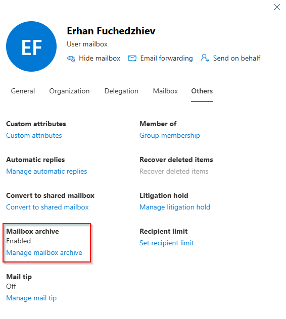
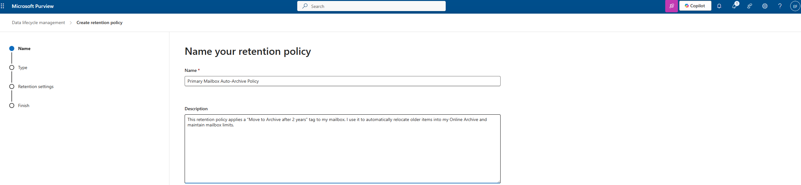
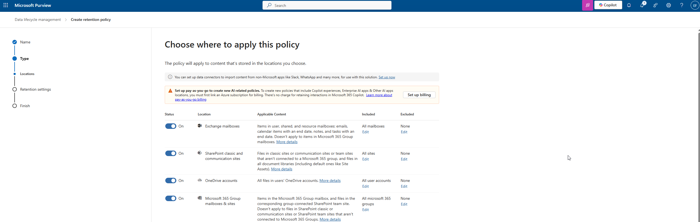
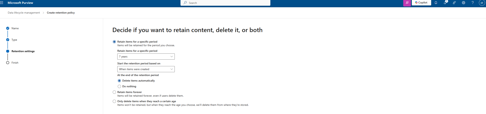

# 08. Exchange Online Archiving

Microsoft Purview – Exchange Data Lifecycle Management

In this part of my project, I configured Exchange Online Archiving for my mailbox.
I enabled the Online Archive mailbox and created a Retention Policy to automatically move older emails into the archive.
This helps me maintain mailbox size limits and keeps my primary inbox clean and manageable.

---

## 1. Enabling My Archive Mailbox

I started in the Microsoft 365 admin center under: Users → Active Users → (My Account) → Mail → Others

There, I enabled the Mailbox archive option.

Once enabled, I could see the Manage mailbox archive link confirming the archive mailbox is active for my account.

---

## 2. Creating My Archive Retention Policy

To automatically move older emails into my Online Archive, I created a dedicated Retention Policy in Microsoft Purview.

I went to: Microsoft Purview → Data Lifecycle Management → Retention Policies → Create Policy

---

2.1 Name & Description

- I named my policy: Primary Mailbox Auto-Archive Policy
- Description: I use this retention policy to apply a “Move to Archive after 2 years” tag to my mailbox. It automatically relocates older mail items into my Online Archive and helps me maintain healthy mailbox limits.

---

## 2.2 Policy Type

- I selected: Static - (because I only need to target Exchange mailboxes directly)

---

## 2.3 Choose Locations

- I applied this policy only to: Exchange mailboxes and left everything else unchecked.

---

## 2.4 Retention Settings

To automatically move old mail to the archive, I configured:

- Retain items for: 7 years (example for the project)
- Start based on: When items were created
- At the end of retention: Delete items automatically: (In a real archive policy, this can be “Do nothing” if the goal is purely archiving — but for my project I show 7-year retention as well.)

## 3. Completing the Policy

After reviewing all settings, I completed the creation wizard and the policy became active.
Exchange automatically applies the retention tags to my mailbox.

---

## Summary

Here’s what I accomplished in this module:

| Component                 | Result                                                       |
| ------------------------- | ------------------------------------------------------------ |
| **Archive Mailbox**       | Enabled for my user                                          |
| **Retention Policy Name** | Primary Mailbox Auto-Archive Policy                          |
| **Archive Logic**         | Move items older than 2 years to Online Archive              |
| **Retention Logic**       | Retain mail for 7 years, delete after (for compliance demo)  |
| **Scope**                 | Exchange mailboxes                                           |
| **Purpose**               | Reduce primary mailbox size and enforce lifecycle management |

This configuration ensures that my mailbox stays clean, older items are automatically archived, and I follow best practices for email data retention.
