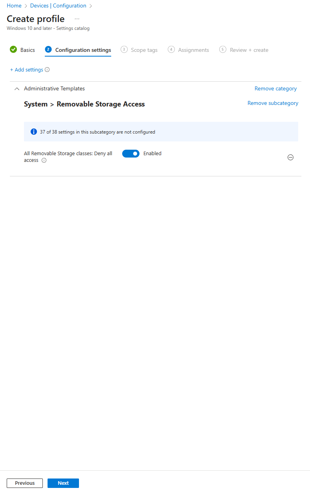
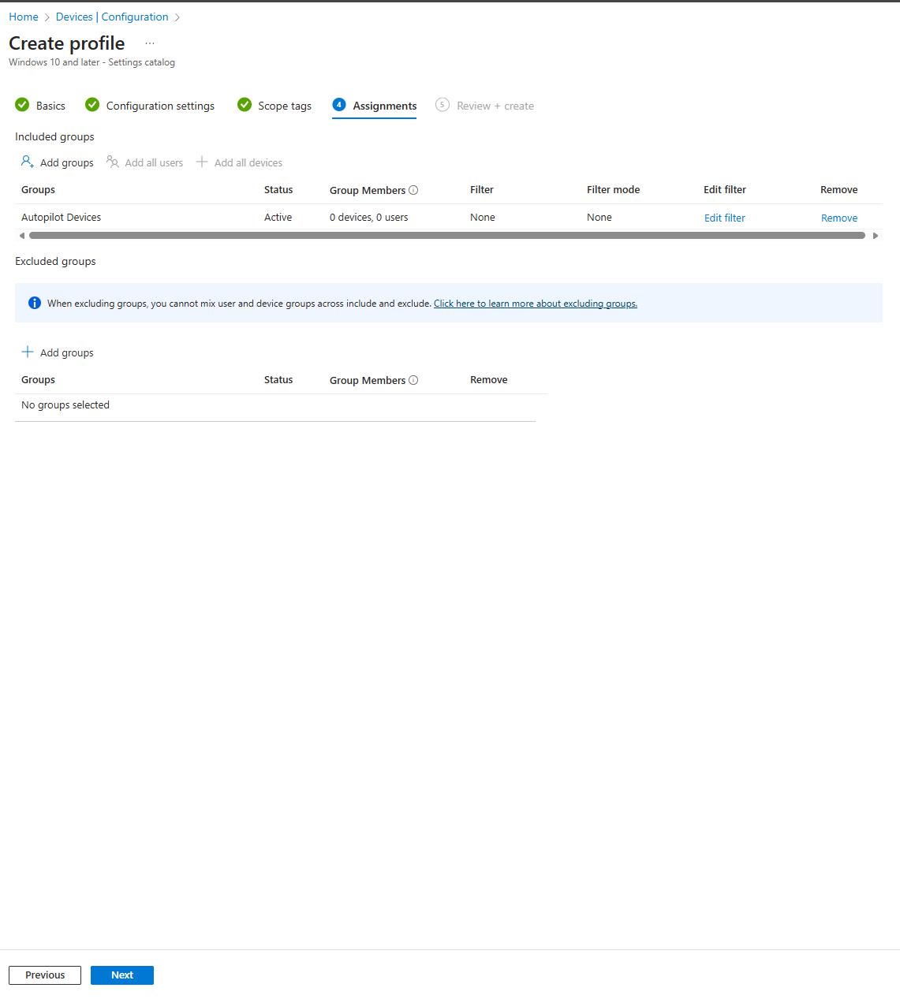
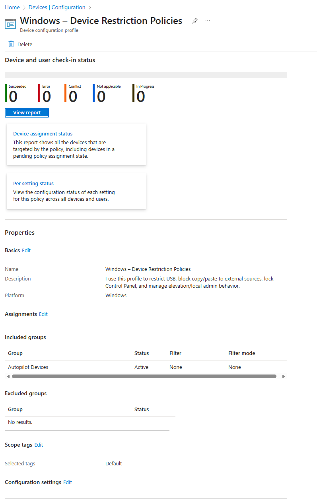

# 08 – Windows Device Restriction Policies

In this section, I create a Windows Device Restriction Policy using Intune.  
This profile blocks USB/removable storage, restricts external data transfer, and prepares the foundation for additional lockdown policies such as Control Panel access and elevation restrictions.

---

## 1. Create the Device Restriction Policy

In Intune:

**Devices → Configuration → Create profile**

- **Platform:** Windows 10 and later  
- **Profile type:** Settings catalog  
- **Name:** *Windows – Device Restriction Policies*  
- **Description:**  I use this profile to restrict USB, block copy/paste to external sources, lock Control Panel, and manage elevation/local admin behavior.

---

## 2. Add USB / Removable Storage Restrictions

I click **Add settings** and search for: Removable Storage Access

From the category list, I select:

**Administrative Templates → System → Removable Storage Access**

Then I enable:

### All Removable Storage classes: Deny all access

This setting blocks:

- USB flash drives  
- External HDD/SSD  
- SD cards  
- Smartphone storage  
- Any removable media device

---

## 3. Scope Tags

I use the **Default** scope tag.

---

## 4. Assignments

I assign the policy to:

- **Autopilot Devices**

---

## 5. Review + Create

After creating the profile, I verify it appears in Intune and is assigned correctly.

---

## Summary

With this profile, I have:

- Blocked all USB and removable storage  
- Prepared the foundation for further restriction policies  
- Assigned the policy to Autopilot devices as part of my Modern Workplace baseline  

Additional restrictions such as clipboard blocking, Control Panel lockdown, and elevation control can be added later if required.

---
