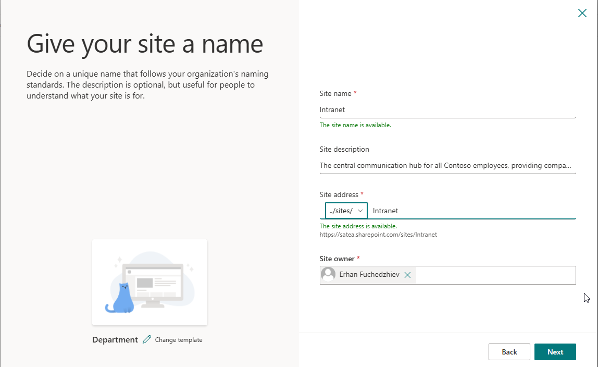
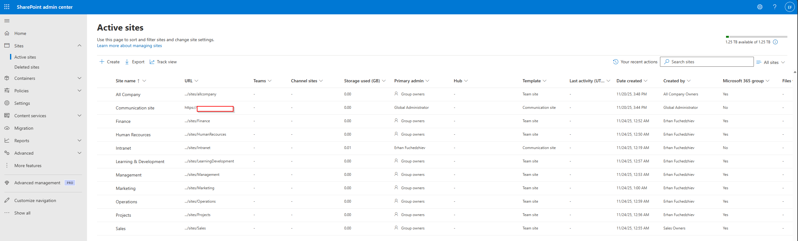
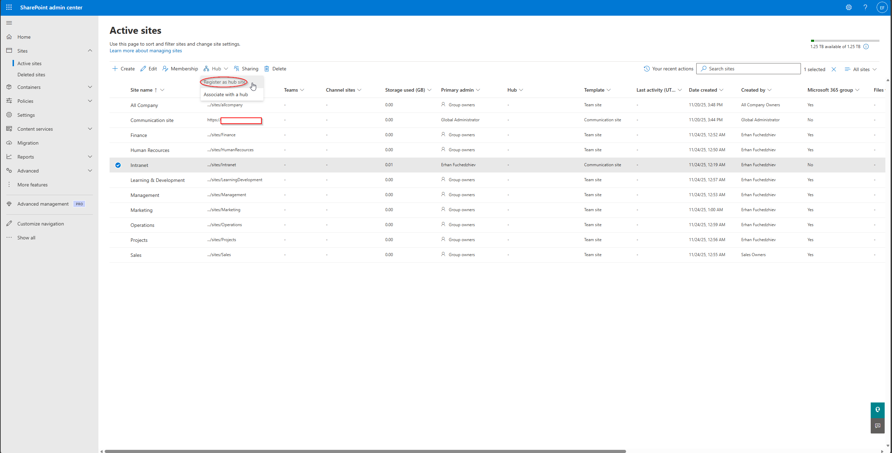
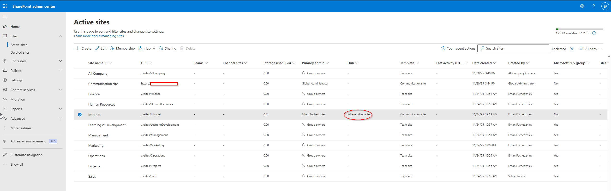
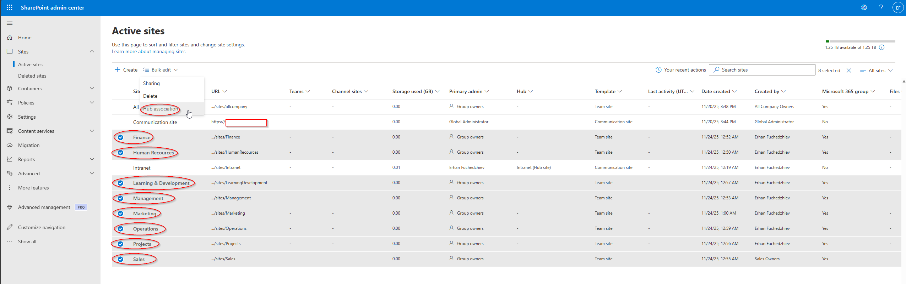
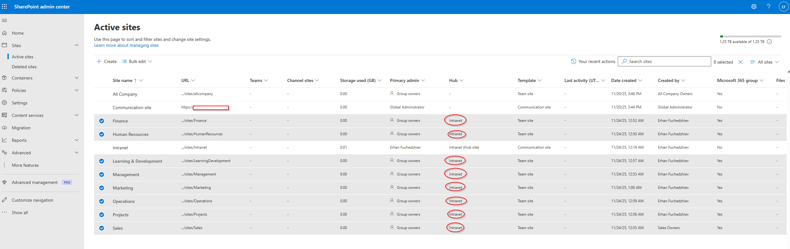

# 09 – SharePoint Information Architecture

## Modern SharePoint Hub Design for a Structured Digital Workplace

In this part of my Modern Workplace project, I designed and built my SharePoint Online Information Architecture (IA), which now serves as the foundation for all collaboration, governance, document lifecycle, and future migration activities.
I created my Intranet hub, deployed all departmental sites, associated them to the hub, and established a scalable, Copilot-ready structure aligned with Microsoft 365 best practices.
This article walks through each step of the process and includes screenshots of my configuration.

---

## 1. Creating the Intranet Communication Site

I began by creating my Intranet communication site.

This site acts as the central hub for my entire organization and provides:

- Company-wide news
- Corporate resources
- Global navigation
- Central branding
- Unified search

Once created, the Intranet appeared in my Active Sites list.

---

## 2. Creating All Department Sites

After the Intranet was in place, I created a dedicated Team Site for each department.
I configured every site as Private, following least-privilege and zero-trust principles.

The department sites I created include:

- Human Resources
- Finance
- Marketing
- Sales
- Operations
- Management
- Projects
- Learning & Development

These sites now act as the primary containers for all departmental files and future migration activities.

---

## 3. Registering the Intranet as a Hub Site

Next, I registered my Intranet as a Hub Site, allowing it to serve as the root of my SharePoint hierarchy.

Registering the hub instantly enables:

- Hub navigation
- Branding inheritance
- Unified permissions logic
- Central governance

Consistent experience across all departments.

---

## 4. Associating Each Department Site With the Intranet Hub

Once all department sites were created, I associated each one with my Intranet Hub.

This step provided:

- Shared navigation
- Consistent branding
- Centralized governance
- Logical site hierarchy
- Improved search experience

I applied these associations in bulk for efficiency.

---

## 5. Final Verification – All Sites Connected to the Hub

After completing the associations, I verified that the Hub column for every department site correctly showed Intranet.

This confirmed that my Information Architecture is aligned, structured, and ready for content migration.

---

## Final Result

With all steps completed, my SharePoint Online Information Architecture now includes:

- A centrally managed Intranet hub site
- Private departmental team sites
- Full hub association for consistent branding and navigation
- A clean, scalable structure for document migration
- Alignment with Copilot readiness
- Governance-friendly site separation
- A modern M365-compliant information architecture

This structure now serves as the foundation for:

- SharePoint migration
- OneDrive rollout
- Data governance
- Sensitivity label architecture
- Copilot document exposure control
- Organizational knowledge structure

My SharePoint IA is now modern, secure, scalable, and fully aligned for the next steps of my Modern Workplace project.

