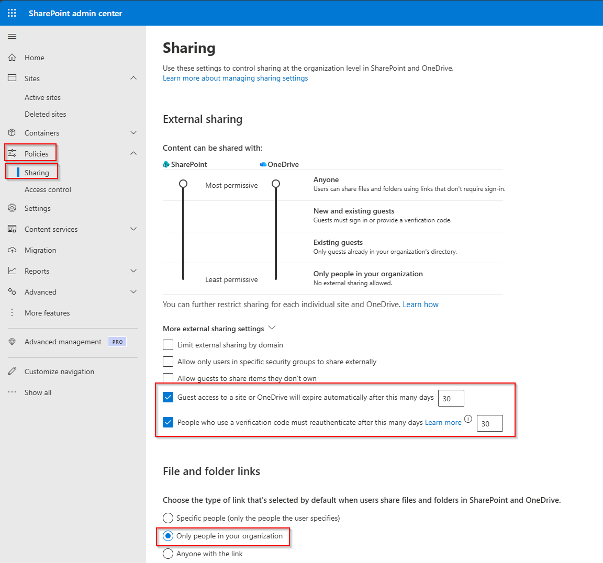
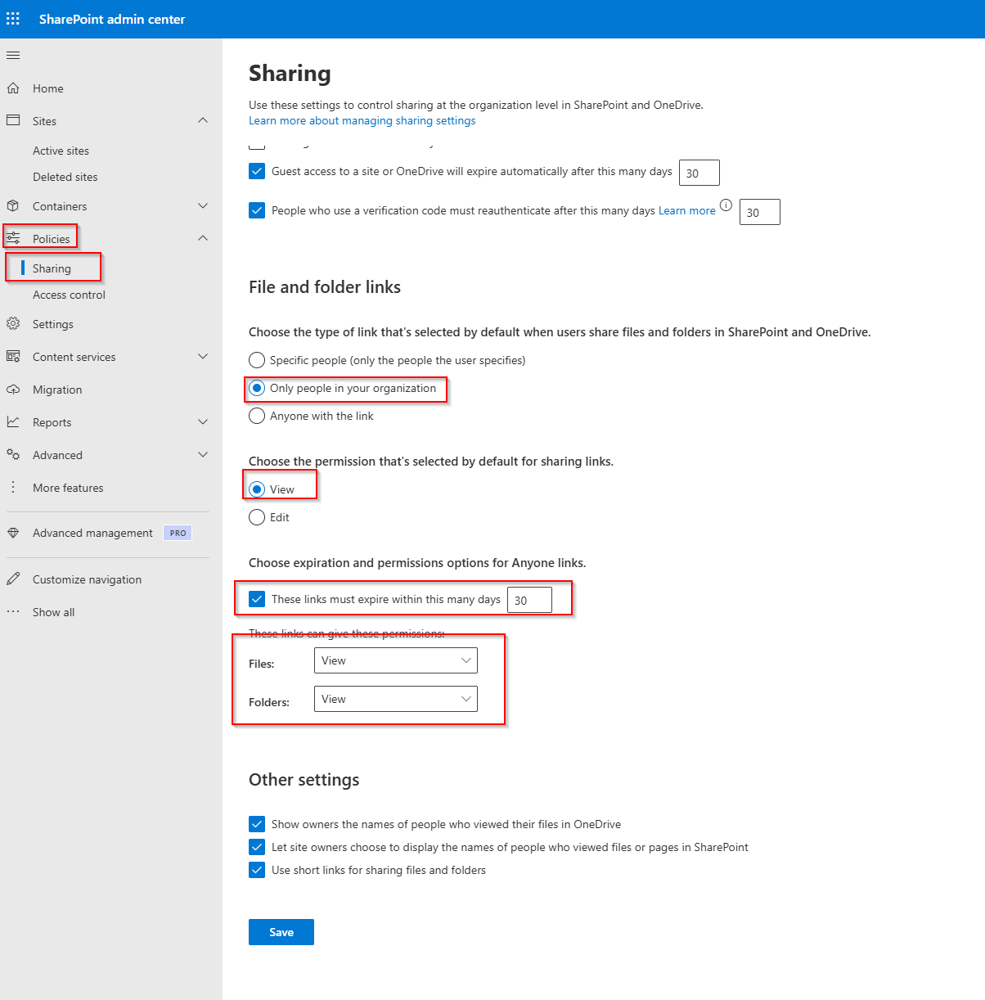
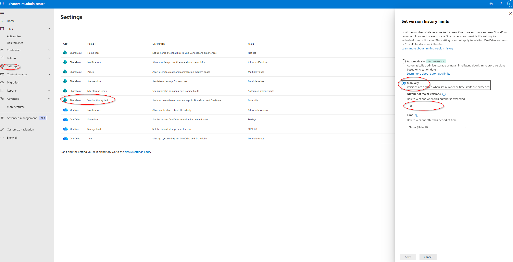
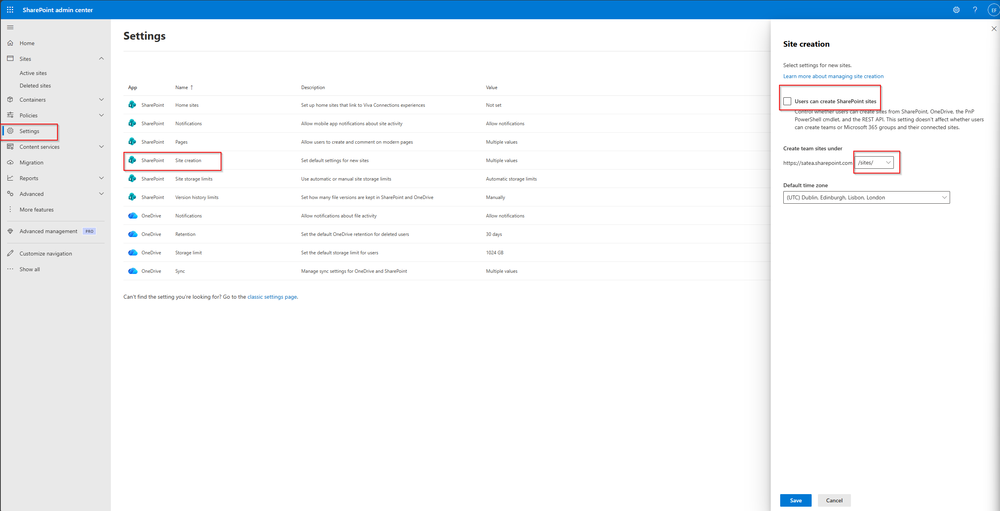

# 10 – SharePoint Admin Configuration

---

## Hardening Sharing, Versioning & Site Creation Policies**

In this part of my Modern Workplace project, I configured the core SharePoint Online and OneDrive organization-wide settings to ensure security, control, and compliance before beginning any content migration.

These settings define how users share files, how versions are stored, and who is allowed to create SharePoint sites.
I followed Microsoft 365 best practices and adjusted the environment to a secure and governance-friendly baseline.

---

## 1. Configuring Secure Sharing Policies

I began by opening SharePoint Admin Center → Policies → Sharing and configured the global sharing controls for SharePoint and OneDrive.

My focus was to enforce a secure external sharing posture without blocking legitimate collaboration.

External Sharing Settings I Applied:

- SharePoint: New and Existing Guests
- OneDrive: New and Existing Guests
- Guest access expires: 30 days
- Guests must reauthenticate: 30 days
- Disabled insecure options like:
  - "Allow guests to share items they don’t own"
  - "Anyone links" as the default sharing option

These settings ensure that guest access is temporary, authenticated, and monitored.

---

## 2. Setting Version History Limits

Next, I configured the Version History Limits to prevent unnecessary storage consumption.

Although SharePoint automatically keeps many versions, I switched to manual control and enforced:

- Maximum versions: 500
- Retention cleanup: Never delete based on time
- Applies to: All new SharePoint and OneDrive libraries

This provides enough version depth for recovery without creating excessive growth in the tenant.

---

## 3. Restricting SharePoint Site Creation

To maintain control over the information architecture and prevent users from creating unmanaged sites, I configured the Site Creation policy.

Changes I applied:

- Disabled: “Users can create SharePoint sites”
- Default site path: /sites/
- Default time zone: UTC Dublin, Edinburgh, Lisbon, London

This ensures that all new sites are created intentionally, consistently, and within governance.

Final Result

After applying all settings, my SharePoint Online environment is now secured and structured with:

- A locked-down external sharing configuration
- Controlled version history limits
- Centralized governance for new SharePoint site creation
- Consistent defaults across all site collections
- A security posture aligned with Microsoft 365 Zero Trust requirements
- Full readiness for the upcoming SharePoint migration phase

This completes the SharePoint administrative configuration phase of my project, and my tenant is now properly hardened and optimized for the next steps.
