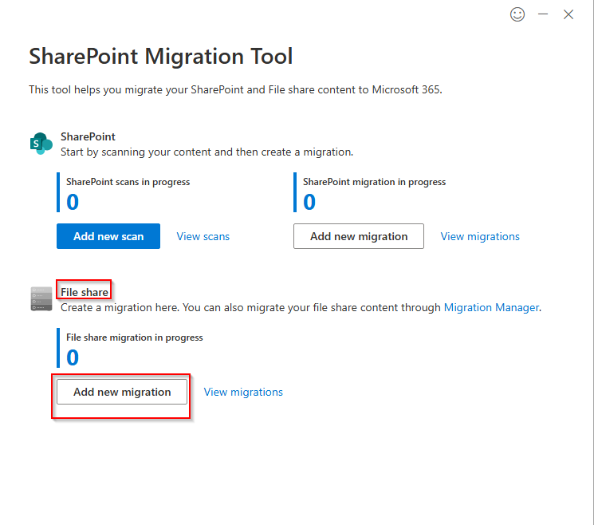
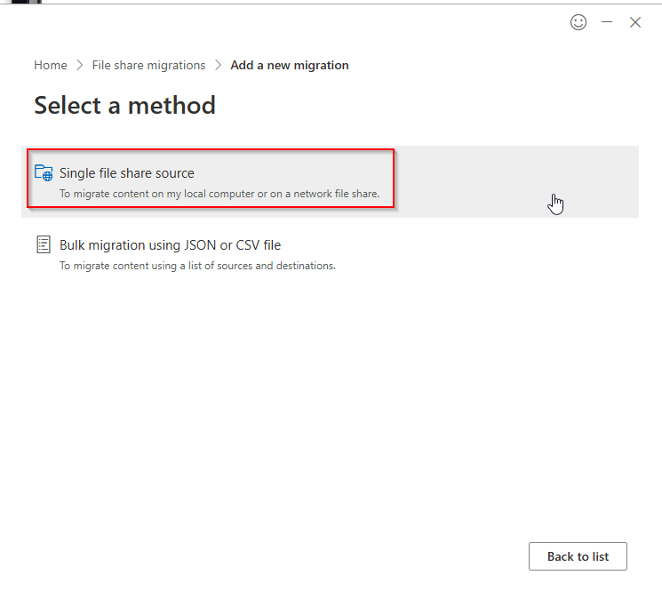
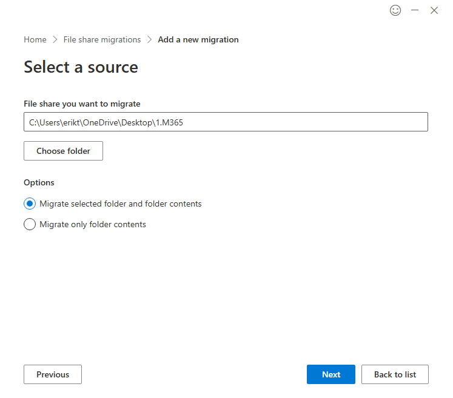
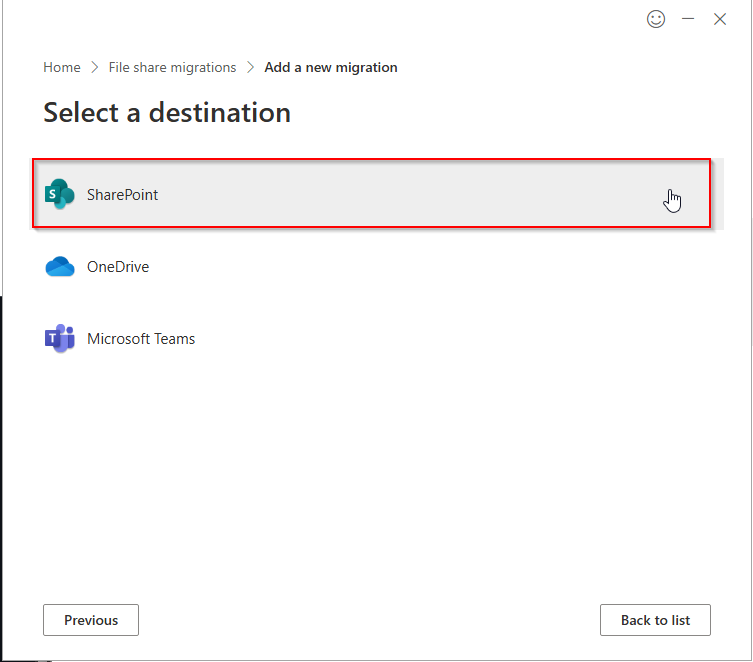
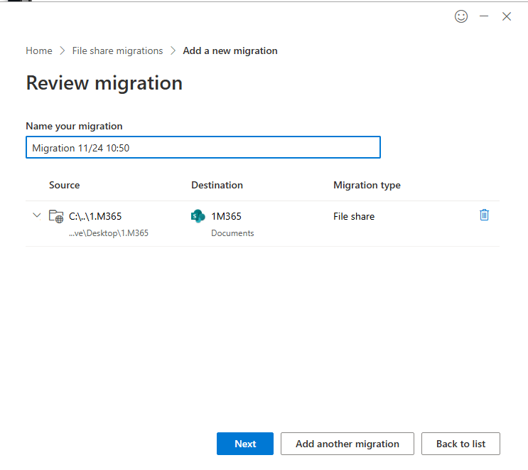
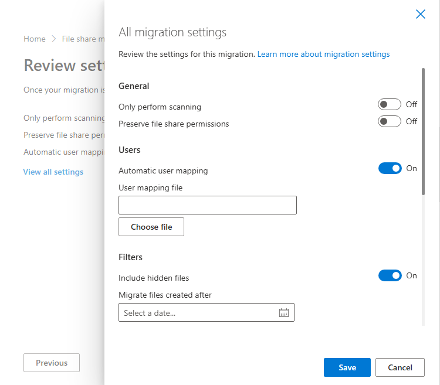
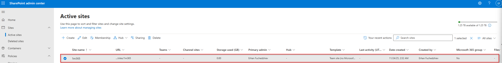

# 11 – SharePoint Migration (SPMT) Setup & Execution

---

### Migrating Legacy File Share Content Into SharePoint Online

In this part of my Modern Workplace project, I started the **SharePoint migration phase** using the **SharePoint Migration Tool (SPMT)**.  
My goal was to simulate a real-world file server migration by preparing a sample folder on my device and migrating it into a dedicated SharePoint site.

This article documents the full workflow I followed, step-by-step, including settings, validation, and final results.

---

## 1. Launching the SharePoint Migration Tool

I opened the **SharePoint Migration Tool** and selected **File share → Add new migration** since my goal was to migrate a local folder into SharePoint Online.

---

## 2. Selecting the Migration Method

I chose the **Single file share source** option.  
This is ideal when I want to migrate one folder at a time from my local machine.

---

## 3. Choosing the Source Folder

Next, I selected the folder on my device that contains the sample legacy content.

I kept the default option: *Migrate selected folder and folder contents*

---

## 4. Selecting the Destination

Since this project focuses on SharePoint information architecture, I chose **SharePoint** as the destination.

---

## 5. Mapping to the SharePoint Site

I mapped the local folder to my SharePoint site **1M365**, specifically to its **Documents** library.

I also named the migration job using a timestamp to keep things organized.

---

## 6. Reviewing and Adjusting Migration Settings

Before starting the migration, I reviewed the advanced settings:

- **Only perform scanning** → Off  
- **Preserve file share permissions** → Off (I want a clean cloud baseline)
- **Automatic user mapping** → On  
- **Include hidden files** → On  
- **Migrate files created after…** → Not set  

This configuration gives me a simple, clean migration with no unnecessary ACL complexity.

---

## 7. Running the Migration

Once everything was configured, I clicked **Start** and the migration process began.  
SPMT uploaded my sample content into SharePoint Online.

---

## 8. Final Verification in SharePoint Admin Center

After the migration completed, I verified the content by navigating to:

**SharePoint Admin Center → Active Sites → 1m365 → Documents**

My new SharePoint site now contains the migrated data.

---

# Final Result

By completing this migration, I successfully validated:

- The SharePoint Migration Tool setup  
- Mapping local file share content to SharePoint Online  
- Correct migration of folder structure and files  
- The new SharePoint site receiving and storing content  
- Proper alignment with my Information Architecture  

This confirms that my tenant is ready for **full-scale SharePoint migration**, whether from file servers, on-prem SharePoint, or user shares.

Next, I’ll continue optimizing the environment with:

- Metadata planning  
- Sensitivity labels for migrated data  
- Retention policies  
- Search optimization  
- Copilot readiness validation  

My SharePoint environment is now fully prepared for enterprise-grade migration workloads.
