# Microsoft 365 Email Protection Policies - Anti-Phishing • Anti-Spam • Safe Links / Safe Attachments

In this guide, I document how I configure my email protection in Microsoft 365 Defender.
I follow a clean structure so I can reuse this procedure for my Contoso-style project without revealing personal domains.

---

## 1. My Anti-Phishing Policy
   
### 1.1 Create the Policy

I go to:

Microsoft Defender → Email & Collaboration → Policies & Rules → Threat Policies → Anti-Phishing → Create Policy

I choose:

- Name: Custom Anti-Phishing Policy
- Description: “I use enhanced anti-phishing protection with impersonation protection, mailbox intelligence, and quarantine actions.”

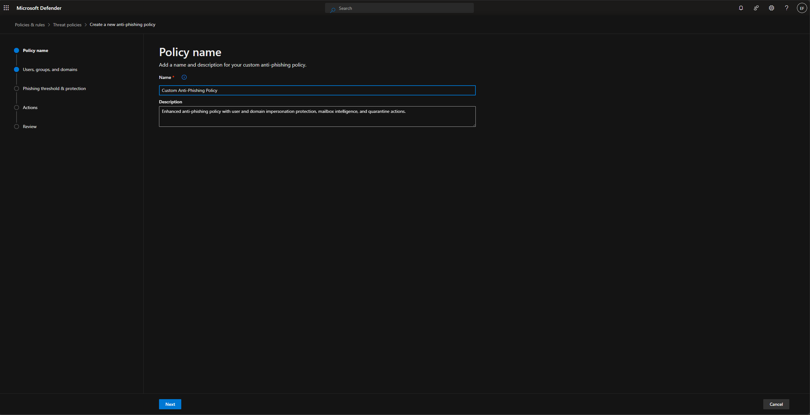

---

### 1.2 Users, Groups, and Domains

I include:

- Users: All Company
- Groups: (empty)
- Domains: (empty)

This means my policy applies to everyone in my tenant.

---

### 1.3 Phishing Threshold & Protection

Phishing Email Threshold: I set it to 1 – Standard.

Impersonation Protection
I enable:

- Enable users to protect – 0 users (optional)
- Enable domains to protect – On
- Include domains I own

Trusted Senders & Domains: I keep it empty (I add trusted senders only if needed later).

Mailbox Intelligence: 

- Mailbox Intelligence: ON
- Mailbox Intelligence for Impersonation: ON

Spoof Intelligence: Enable Spoof Intelligence: ON

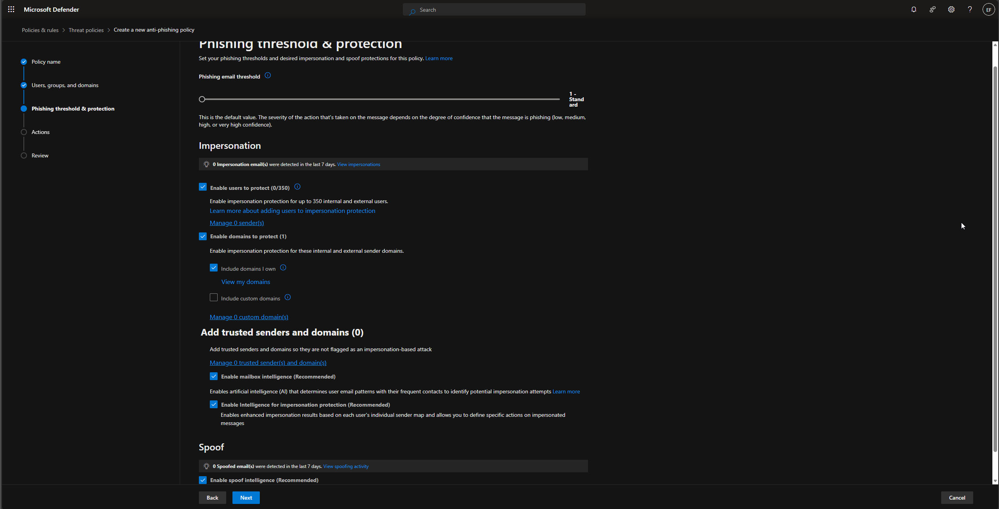

---

### 1.4 Actions

If a mesage is detected as user impersonation
- Action: Quarantine the message
- Quarantine Policy: DefaultFullAccessPolicy

If detected as domain impersonation
- Action: Quarantine the message

If detected by Mailbox Intelligence
- Action: Quarantine the message

If detected as spoof and DMARC = quarantine
- Action: Quarantine

If detected as spoof and DMARC = reject
- Action: Quarantine (instead of reject to avoid losing emails)

If detected as spoof by spoof intelligence
- Action: Quarantine
- Qarantine policy: DefaultFullAccessPolicy

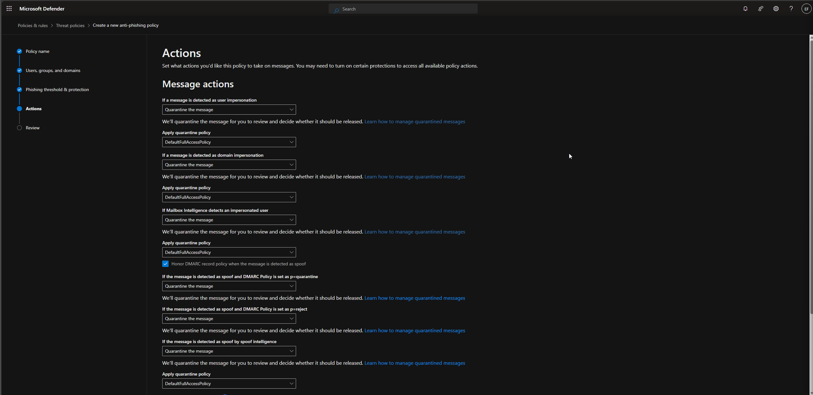

## 2. My Anti-Spam Inbound Policy

---

### 2.1 Create Policy

I go to:

Policies & Rules → Threat Policies → Anti-Spam → Create Policy → Inbound

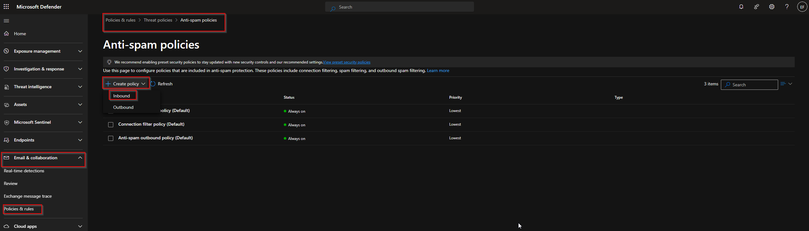

Name: Custom Inbound Anti-Spam Policy

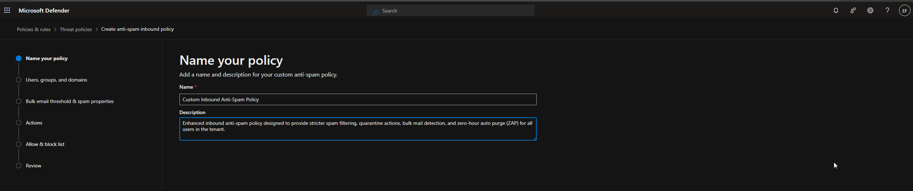

### 2.2 Users, Groups, and Domains

Same as phishing:

- Users: All Company
- Groups: (empty)
- Domains: (empty)

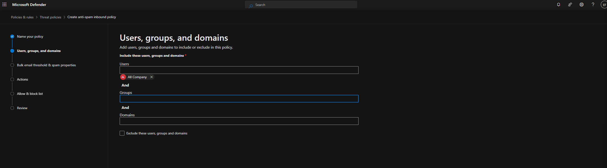

### 2.3 Bulk Email Threshold & Spam Properties

Bulk email threshold: I set it to 6

Spam Properties

I keep everything Off unless needed:

- Image links to remote sites → Off
- URL redirect to other port → Off
- Numeric IP addresses → Off
- Links to .biz/.info → Off
- Empty messages → Off
- Embedded tags → Off
- JavaScript/VBScript → Off
- Web bugs → Off

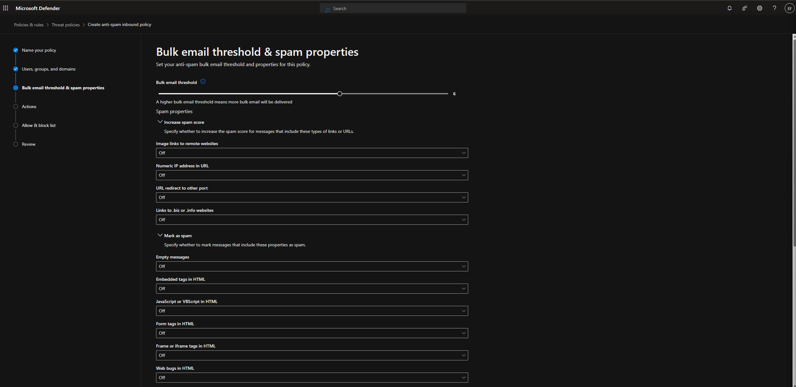

### 2.4 Actions

- Spam: Move message to Junk Email
- High-confidence spam: Quarantine
- Phishing: Quarantine
- High-confidence phishing: Quarantine
- Bulk Complaint Level (BCL): Move message to Junk Email
- Retention: Retain spam in quarantine for 15 days

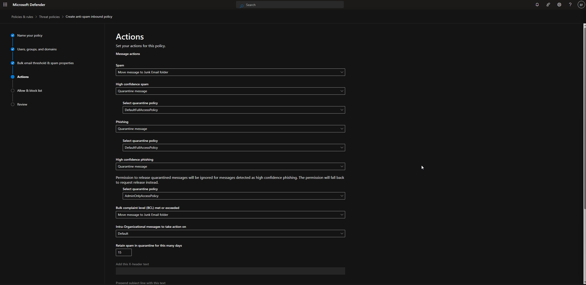

### 2.5 Allow & Block List

I leave everything empty unless required for exceptions:

Allowed: 
- Senders: 0
- Domains: 0

Blocked

- Senders: 0
- Domains: 0

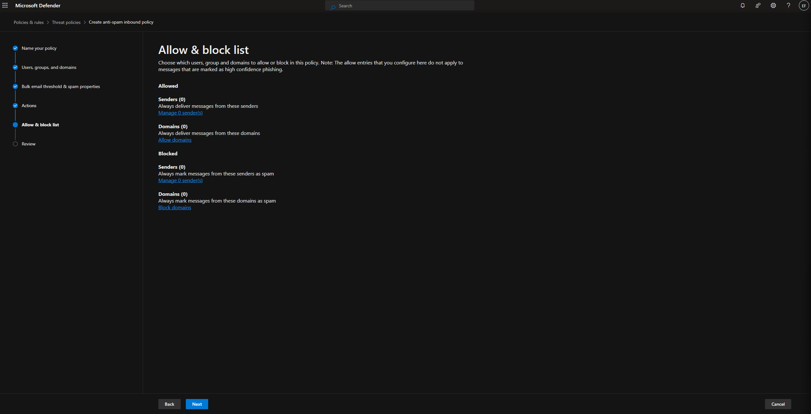

## 3. My Safe Links Policy

---

### 3.1 Create Policy

- Path: Email & Collaboration → Policies → Safe Links → Create
- Name: Safe Links Policy
- Description: “I protect URLs in email, Teams, and Office apps with real-time scanning.”

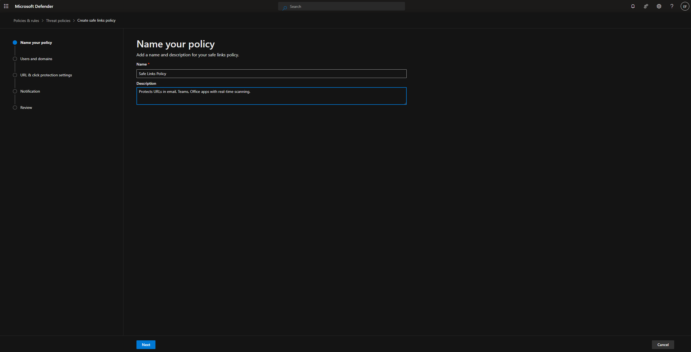

### 3.2 Users and Domains

- Users: All Company
- Groups/Domains: (empty)

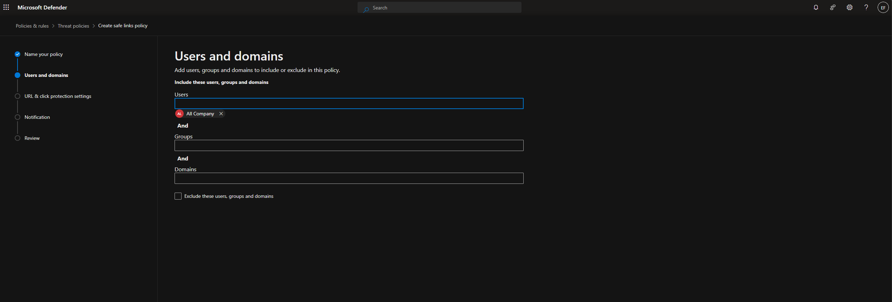

### 3.3 URL & Click Protection Settings

- Email
  - Safe Links scanning → On
  - Apply to email inside organization → On
  - Real-time scanning → On
  - Wait for URL scanning → On
  - Do not rewrite URLs → On

- Teams
  - Safe Links scanning → On

- Office 365 Apps
  - Safe Links scanning → On

- Click Protection
  - Track user clicks → On
  - Let users click through original URL → Off for security
  - Display branding on warning pages → On

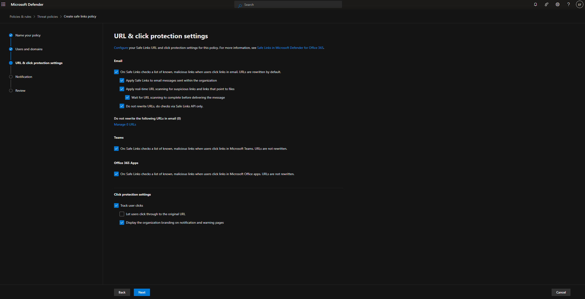 

### 3.4 Notifications

I choose: Use default notification text

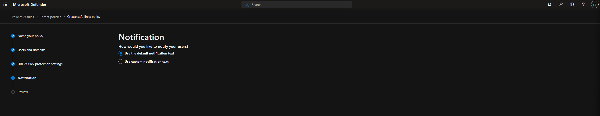 

## 5. Final Review & Recommendations

With these policies, I achieve:

- Strong impersonation detection
- Phishing protection with quarantine
- Spam filtering with high-confidence isolation
- Real-time URL scanning
- Click protection with user tracking
- A uniform policy applied to my whole organization

This setup follows Microsoft best practices and is suitable for both lab and production environments.
