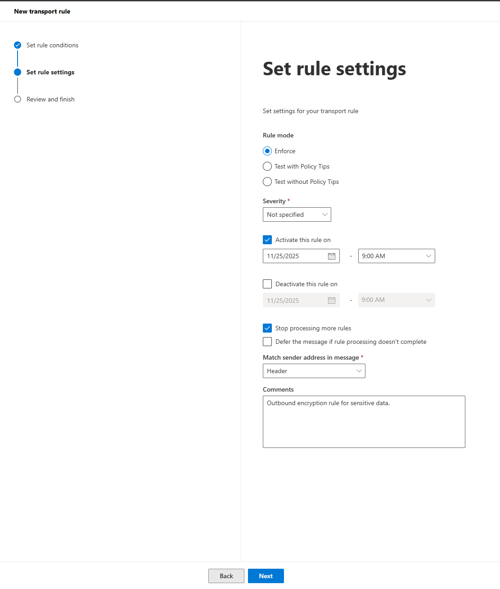
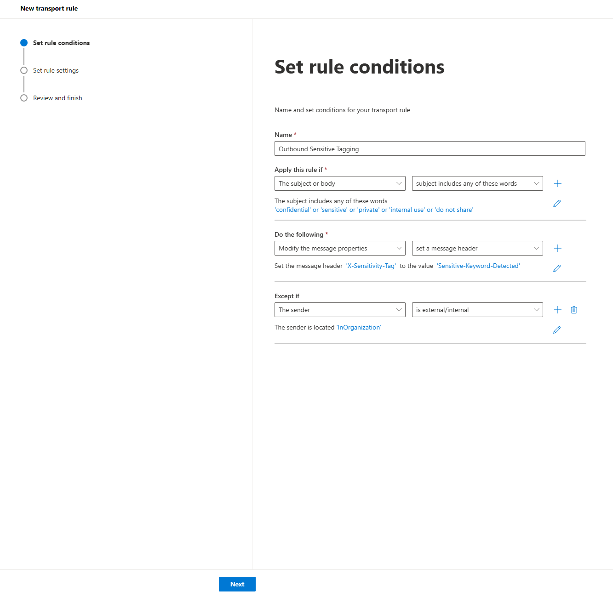
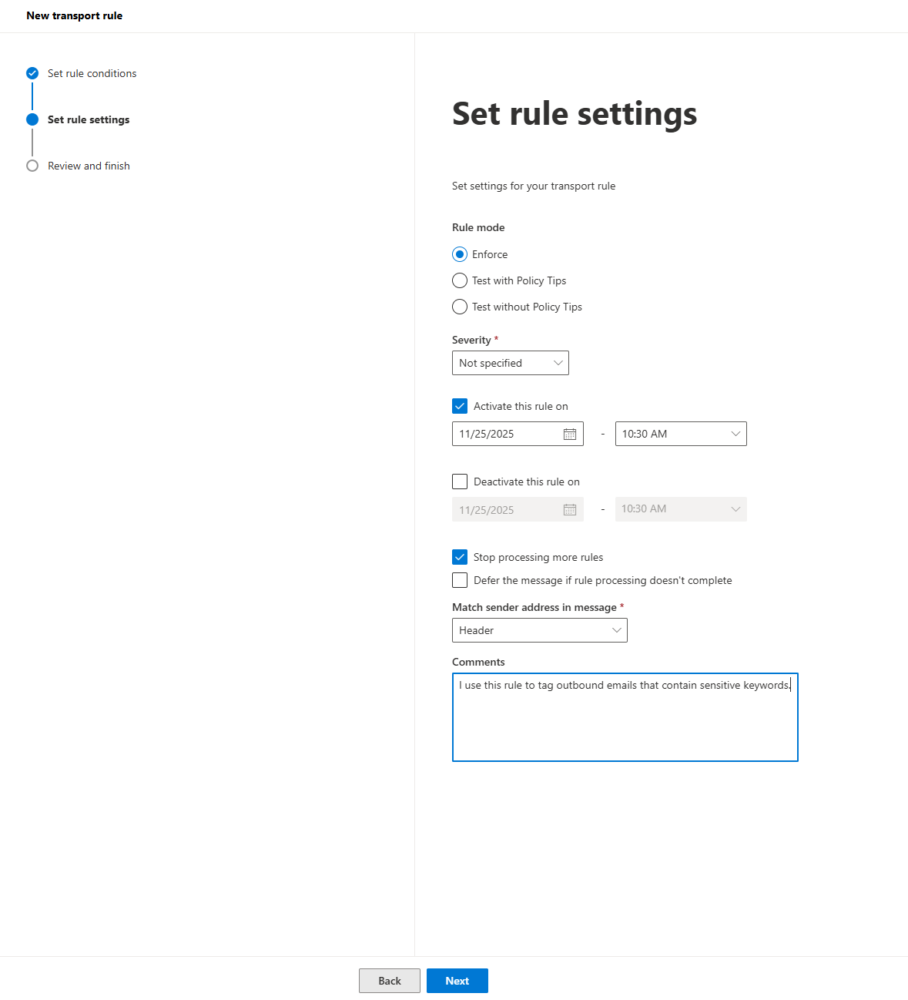
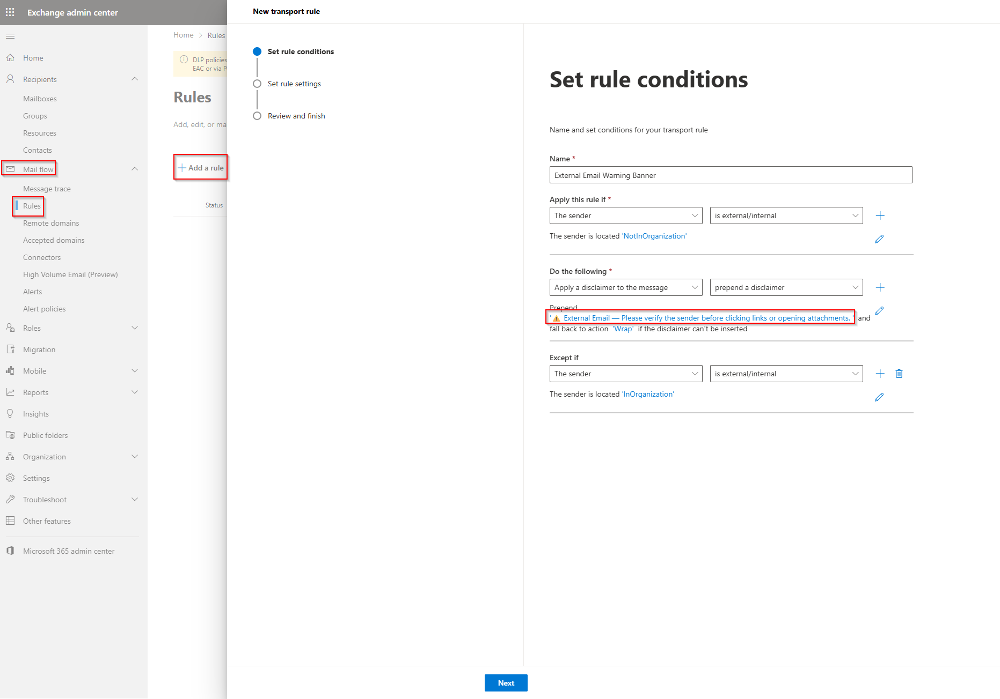
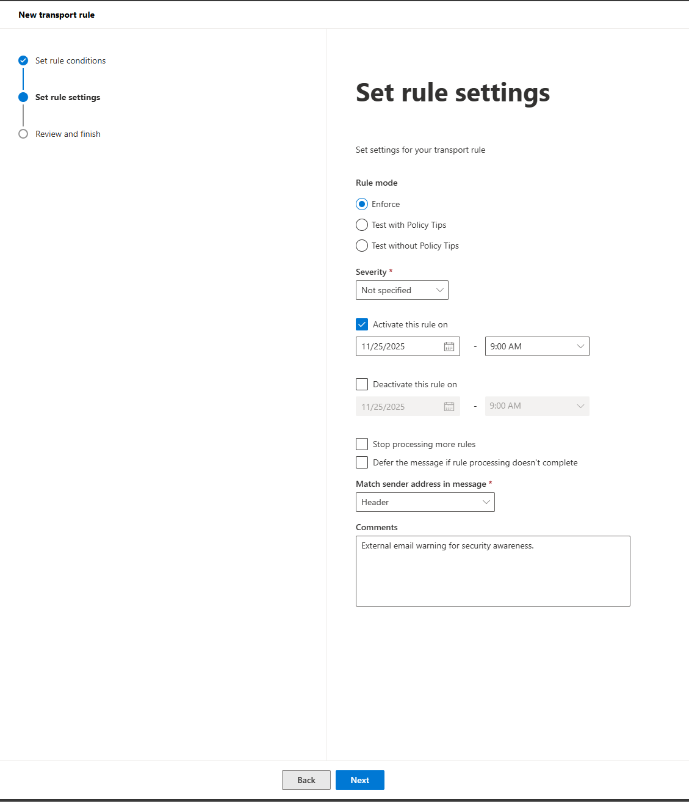
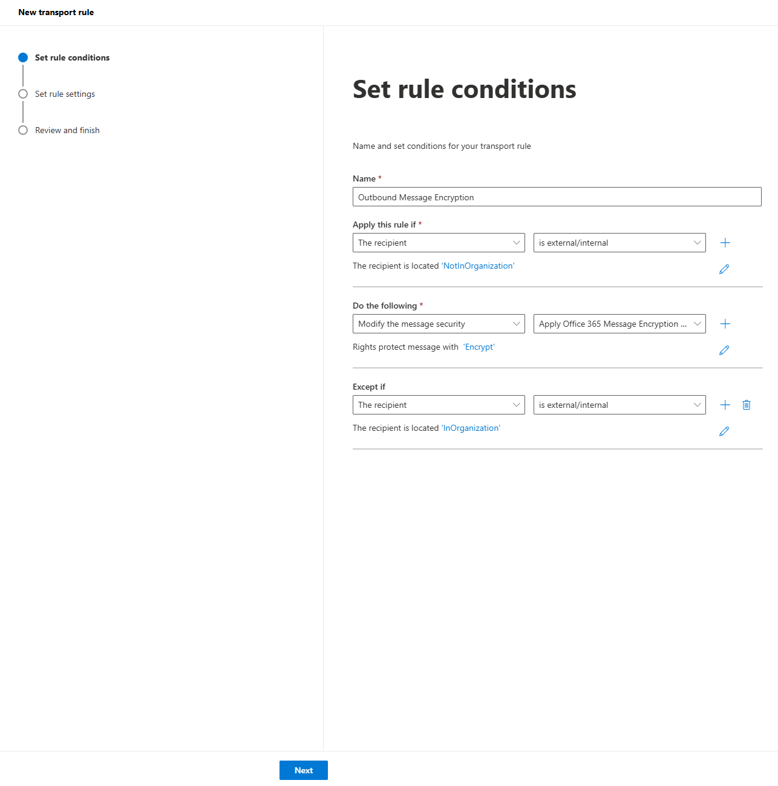
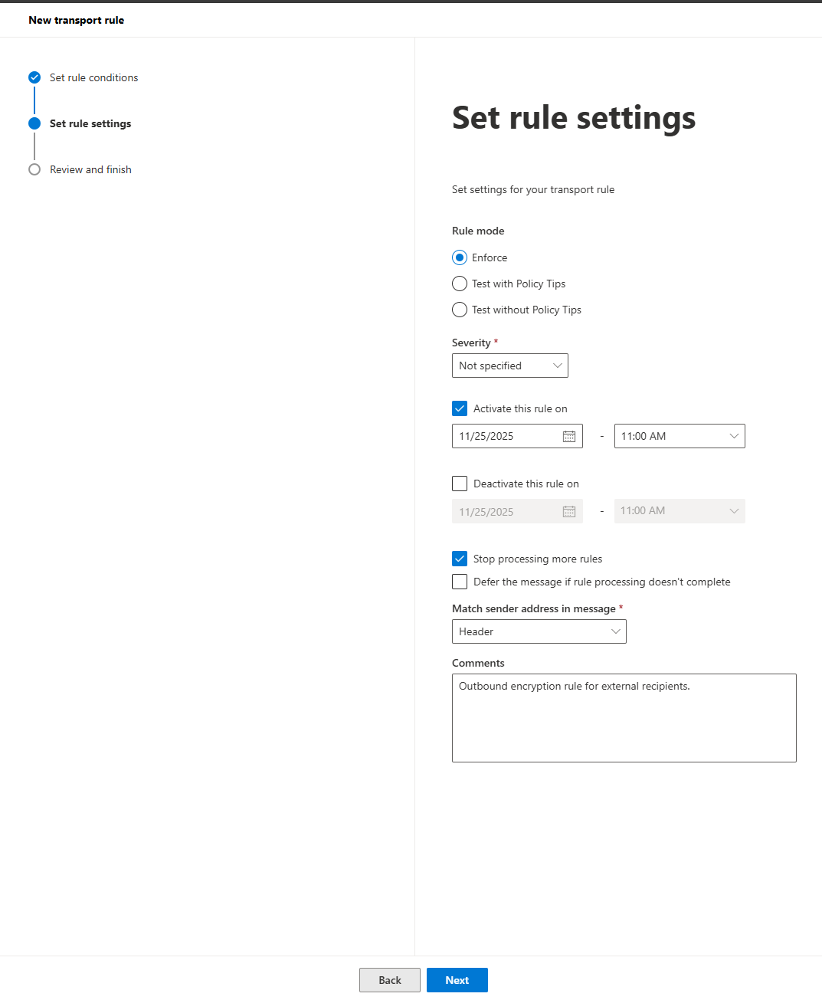

# 13. Exchange Online Transport Rules

This article outlines how I configure essential Exchange Online mail flow rules (transport rules) to improve security, enforce encryption, apply tagging, and provide external email warnings. These rules help me protect sensitive information and increase user awareness.

---

## 1. Outbound Sensitive Data Encryption

Purpose

I use this rule to automatically encrypt outbound email that contains sensitive data and is being sent outside the organization.

Configuration Steps 

### 1.1 Set Rule Conditions

- Apply this rule if:

  - The recipient → is external/internal
  - Location: NotInOrganization

- Do the following:
  - Modify the message security → Apply Office 365 Message Encryption and rights protection
  - Encrypt

- Except if:
  - The recipient → is external/internal
  - Location: InOrganization

---

### 1.2 Set Rule Settings

- Rule mode: Enforce
- Activate this rule on: 11/25/2025 – Time: 9:00 AM
- Stop processing more rules: Enabled
- Match sender address in message: Header
- Comments: Outbound encryption rule for sensitive data.

---

## 2. Outbound Sensitive Tagging

Purpose

I use this rule to tag outbound emails that contain sensitive keywords, which helps downstream systems and alerts users about potentially sensitive content.

Configuration Steps

### 2.1 Set Rule Conditions

- Apply this rule if:  
  - The subject or body → subject includes any of these words
  - Keywords: confidential, sensitive, private, internal use, do not share

- Do the following:
  - Modify the message properties → set a message header
  - Header: X-Sensitivity-Tag
  - Value: Sensitive-Keyword-Detected

- Except if:
  - The sender → is external/internal
  - Location: InOrganization
 

--- 

### 2.2 Set Rule Settings

- Rule mode: Enforce
- Activate this rule on: 11/25/2025 – Time: 10:30 AM
- Stop processing more rules: Enabled
- Match sender address in message: Header
- Comments: I use this rule to tag outbound emails that contain sensitive keywords.

---

## 3. External Email Warning Banner

Purpose

This rule adds a visible banner to external messages to remind users to verify the sender before clicking links or opening attachments. It greatly improves phishing awareness.

Configuration Steps

3.1 Set Rule Conditions

- Apply this rule if:
  - The sender → is external/internal
  - Location: NotInOrganization

- Do the following:
  - Apply a disclaimer to the message → prepend a disclaimer
  - Disclaimer text: ⚠️ External Email — Please verify the sender before clicking links or opening attachments.

- Except if:
  - The sender → is external/internal
  - Location: InOrganization

---

### 3.2 Set Rule Settings

- Rule mode: Enforce
- Activate this rule on: 11/25/2025 – Time: 9:00 AM
- Stop processing more rules: Disabled (optional)
- Match sender address in message: Header
- Comments: External email warning for security awareness.

---

###  4. Outbound Message Encryption

Purpose

This rule automatically encrypts outbound messages sent to external recipients using Office 365 Message Encryption (OME).  
It ensures secure delivery of sensitive information outside the organization.

Configuration Steps

### 4.1 Set Rule Conditions

- Apply this rule if:  
  - The recipient → is external/internal  
  - Location: NotInOrganization  

- Do the following:  
  - Modify the message security → Apply Office 365 Message Encryption and rights protection  
  - Rights protect message with: Encrypt  

- Except if:  
  - The recipient → is external/internal  
  - Location: InOrganization  

---

### 4.2 Set Rule Settings

- Rule mode: Enforce  
- Activate this rule on: 11/25/2025 – Time: 11:00 AM  
- Stop processing more rules: Enabled  
- Match sender address in message: Header  
- Comments: Outbound encryption rule for external recipients.  

## Summary

In this article, I created three Exchange Online transport rules:

| Rule Name                              | Purpose                                                        |
| -------------------------------------- | -------------------------------------------------------------- |
| **Outbound Sensitive Data Encryption** | Automatically encrypt sensitive outbound messages             |
| **Outbound Sensitive Tagging**         | Tag emails containing sensitive keywords                       |
| **External Email Warning Banner**      | Add awareness disclaimers for external senders                 |
| **Outbound Message Encryption**        | Encrypt outbound emails sent to external recipients using OME |
