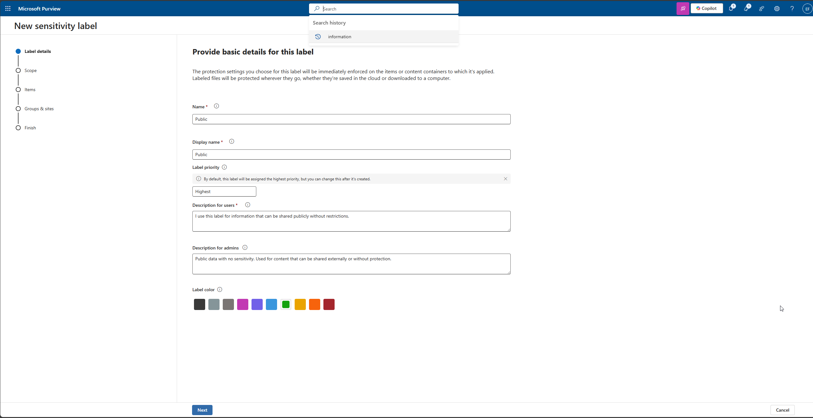
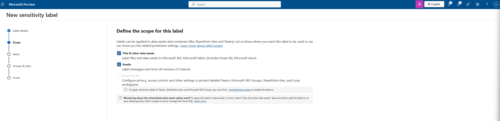
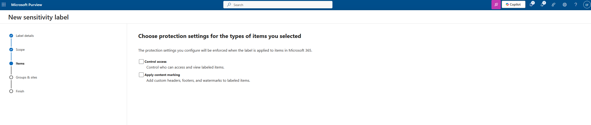
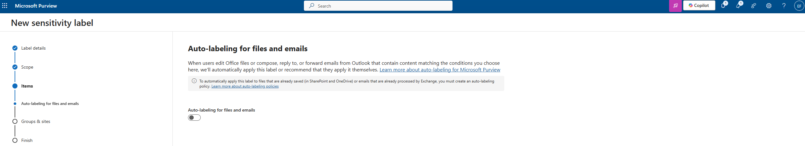
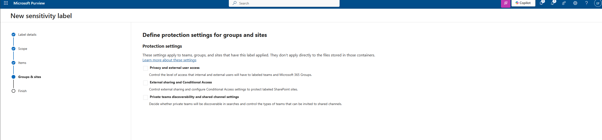

# 14 – Purview Sensitivity Labels Overview

In this article, I explain what Microsoft Purview Sensitivity Labels are, how they help me protect information across my Microsoft 365 environment, and I document the creation of my first label. Sensitivity labels allow me to classify and protect files, emails, and other content based on their sensitivity and business impact.

I also share foundational knowledge about common label types such as Public, Internal, Confidential, and Highly Confidential, before demonstrating how I created a single label as part of my configuration.

---

## 1. What Sensitivity Labels Are

Sensitivity labels help me:

- Classify information  
- Apply protection such as encryption  
- Add headers, footers, or watermarks  
- Control access to sensitive files and emails  
- Prevent data leakage  
- Integrate with DLP and auto-labeling  

A sensitivity label stays with the file or email even after it leaves Microsoft 365.  
This gives me strong protection across:

- Word, Excel, PowerPoint  
- Outlook emails  
- SharePoint & OneDrive  
- Teams  
- Windows/macOS endpoints  

---

## 2. Common Sensitivity Label Types

Most organizations use a label taxonomy like this:

### **Public**
- Lowest sensitivity  
- Can be shared externally or publicly  
- No encryption  
- No restrictions  
- Ideal for marketing, documentation, or information intended for public use  

### **Internal**
- For content that should stay inside the organization  
- No encryption (usually)  
- Optional header/footer like "Internal – Do Not Share Externally"  
- Good for general business communication  

### **Confidential**
- Sensitive but commonly used business information  
- Encryption enabled  
- Limited access (only internal users or specific groups)  
- Can prevent forwarding in Outlook  
- Good for financial data, project documents, contracts  

### **Highly Confidential**
- Critical, private, or regulated data  
- Strongest protection  
- Strict access & Do Not Forward  
- Content watermark like “Highly Confidential”  
- Used for legal, HR, security, executive, or regulated documents  

Even though these four levels exist, **I don’t need to create all of them**.  
The best structure depends on my needs and the size of the environment.

---

## 3. My Approach

For my initial Purview configuration, I decided to create **only one** label:

### **Public**  
This lets me demonstrate the full creation process without needing multiple labels.  
Additional labels can be added later if I choose to expand my classification model.

---

## 4. Creating My Sensitivity Label

Below is how I created my **Public** label using Microsoft Purview.

---

### 4.1 Label Details

I configured the name, descriptions, and color for my label.

**Settings I used:**

- **Name:** Public  
- **Description for users:**  
  *I use this label for information that can be shared publicly without restrictions.*  
- **Description for admins:**  
  *Public data with no sensitivity. Used for content that can be shared externally or without protection.*  
- **Color:** Green  

---

### 4.2 Label Scope

I selected where this label will apply.

**Selected scopes:**

- Files & data assets  
- Emails  
- Groups & sites (not needed)

---

### 4.3 Protection Settings

Because Public data requires no restriction, I left all protection settings disabled.

- No encryption  
- No content marking  

---

### 4.4 Auto-Labeling

I did not enable auto-labeling for Public content.

Auto-labeling is used mainly for sensitive categories such as Confidential and Highly Confidential.

---

### 4.5 Groups & Sites Settings

These apply to Teams and SharePoint site protection, not needed for Public labels.

I left all options unconfigured.

---

## 5. Summary

In this article, I provided an overview of Purview Sensitivity Labels and shared knowledge about each common label type. I also demonstrated how I created my first label (**Public**) to begin building my data classification and protection framework.

| Label | Purpose |
|-------|---------|
| **Public** | My baseline label for non-sensitive and publicly shareable information |

This configuration gives me a solid foundation for future governance. I can later expand this by adding additional labels such as Internal, Confidential, or Highly Confidential as needed.

---
