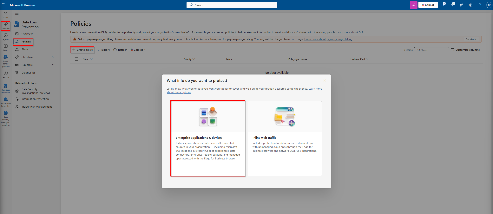
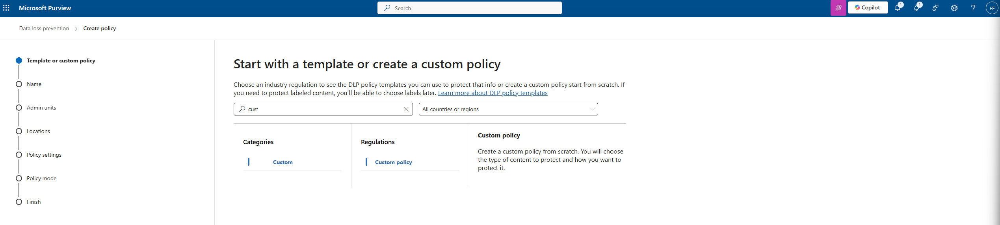
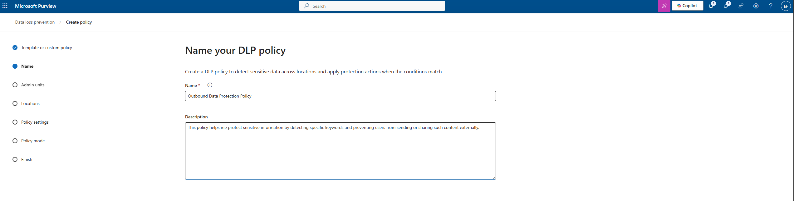
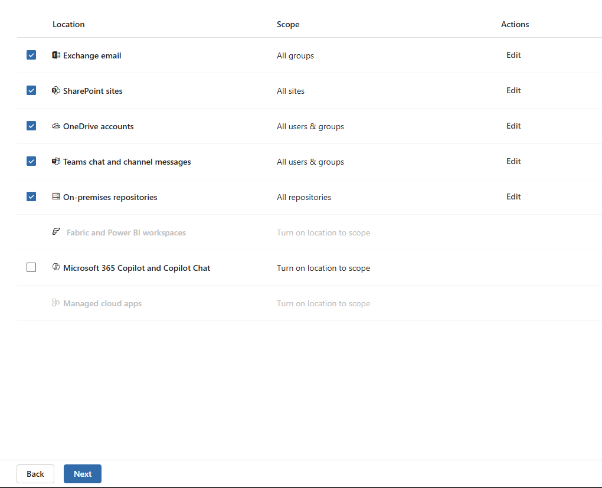
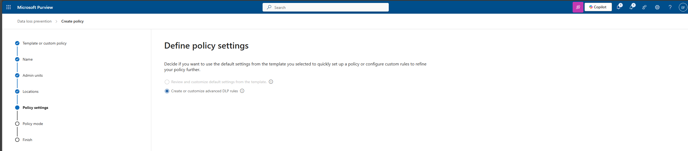
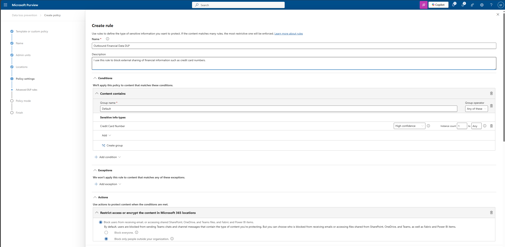
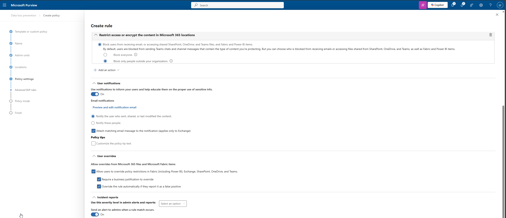

# 03. Data Loss Prevention (DLP) Policies  
*Microsoft Purview – Compliance & Data Protection*

In this section of my project, I created a custom Data Loss Prevention (DLP) policy in Microsoft Purview to help prevent users from accidentally or intentionally sharing sensitive financial information externally.  
This policy is focused specifically on detecting **Credit Card Numbers** and blocking external sharing across Microsoft 365 services.

---

## 1. Purpose

I use DLP policies to:

- Detect sensitive data (e.g., credit card numbers)
- Prevent accidental data leakage outside my organization
- Apply consistent protection across Exchange, SharePoint, OneDrive, and Teams
- Notify users when their actions may violate policy
- Provide audit visibility and governance controls

This policy protects my environment from financial data loss and meets the compliance needs of a modern enterprise.

---

## 2. Creating the DLP Policy

From the Microsoft Purview portal:

1. I navigated to **Data Loss Prevention → Policies**
2. Selected **Create policy**

### **Step 1 – Choose what data I want to protect**
I selected:

**Enterprise applications & devices**  
This includes Exchange, SharePoint, OneDrive, Teams, and Microsoft Copilot experiences.

---

## 3. Start with a Custom DLP Policy

Since I needed full control, I selected:

- **Categories → Custom**
- **Regulations → Custom policy**

---

## 4. Name & Describe the Policy

**Name:**  
**Outbound Data Protection Policy**

**Description:**  
This policy helps me protect sensitive information by detecting specific data types and preventing users from sending or sharing such content externally.

---

## 5. Choose Admin Units  
I selected the default configuration for the entire organization.

---

## 6. Choose Locations

I applied this policy across my full Microsoft 365 estate:

- Exchange email  
- SharePoint sites  
- OneDrive accounts  
- Teams chat & channel messages  
- On-premises repositories  

Copilot and unmanaged cloud apps were left unchecked.

---

## 7. Policy Settings  
I chose the option:

**Create or customize advanced DLP rules**

---

## 8. Configuring the DLP Rule  
I created a custom rule with the following settings:

---

### **Rule Name**  
**Outbound Financial Data DLP**

### **Description**  
I use this rule to block external sharing of financial information such as credit card numbers.

---

## 8.1 Conditions  
I configured the policy to detect:

**Sensitive Info Types:**  
- Credit Card Number  
- Confidence level: **High**  
- Instance count: **1–Any**

**Content is shared from Microsoft 365**  
Trigger when content is shared:

- **With people outside my organization**

---

## 8.2 Actions  
I configured the rule to:

### **Block external sharing**
- **Block only people outside your organization**

This applies to:
- Email sending
- Teams messages
- SharePoint and OneDrive shared content

---

## 8.3 User Notifications  
I enabled:

Notify the user who triggered the rule  
Attach matching email message to the notification (Exchange only)

This educates users on proper handling of sensitive information.

---

## 8.4 User Overrides  
I enabled:

✔ Allow overrides with justification  
✔ Auto-resolve if

