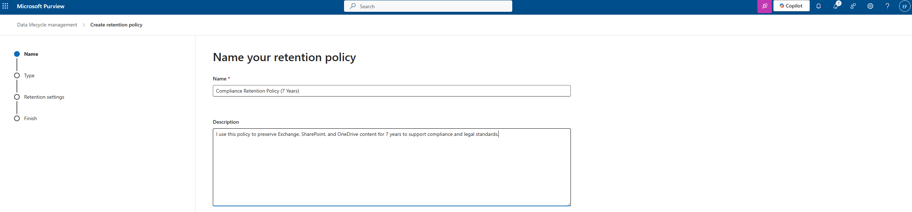
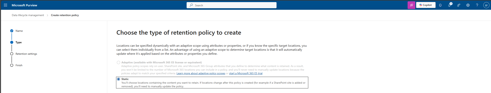
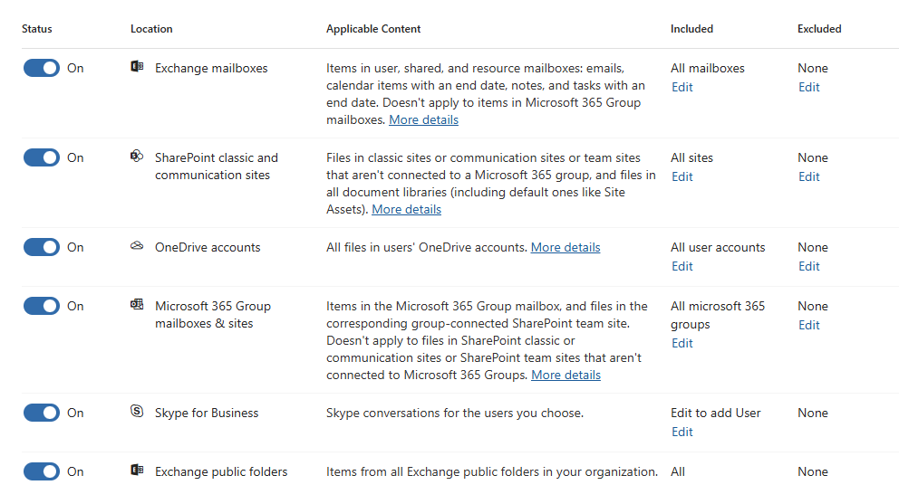
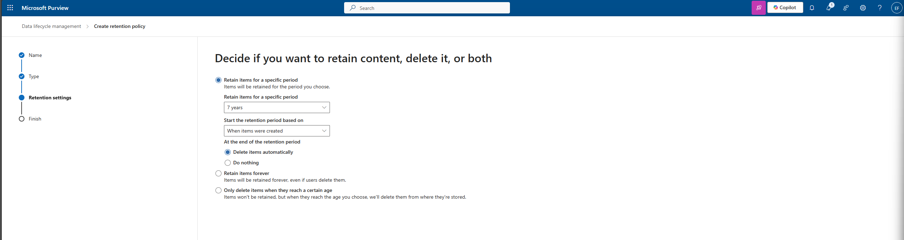

# 16. Retention Policy (Data Lifecycle Management)

Microsoft Purview – Compliance & Data Governance

In this section of my project, I created a Retention Policy within Microsoft Purview to ensure that organizational content is preserved for compliance purposes and automatically deleted after a defined period.
This policy is focused specifically on keeping content for 7 years and then deleting it automatically.

---

## 1. Purpose

I use retention policies to:

- Ensure critical content is preserved for legal, regulatory, and business needs
- Prevent premature deletion of important emails, documents, and records
- Automatically delete content after it reaches the defined retention period
- Apply consistent lifecycle controls across Microsoft 365 services

This supports my overall compliance strategy and ensures long-term data governance.

---

## 2. Creating the Retention Policy

From the Microsoft Purview portal:

- I navigated to Data Lifecycle Management → Retention Policies
- Selected Create retention policy

---

## 3. Name & Describe the Policy

Name:
Compliance Retention Policy (7 Years)

Description:
I use this policy to preserve Exchange, SharePoint, and OneDrive content for 7 years to support compliance and legal standards.

---

## 4. Choose Policy Type

I selected:

Static: Because static policies allow me to manually select the locations where the policy should apply.

Adaptive scopes require E5, so static was the correct choice for my environment.

---

## 5. Select Locations

I applied this retention policy across the major Microsoft 365 workloads:

- Exchange mailboxes
- SharePoint sites
- OneDrive accounts
- Microsoft 365 Group mailboxes & sites
- Skype for Business (optional)
- Exchange public folders

This ensures broad and consistent retention across the tenant.

---

## 6. Retention Settings

I configured the retention behavior as follows:

- Retention Duration
  - Retain items for a specific period
  - 7 years

- Start retention period based on:
  - When items were created

- At the end of the retention period:
  - Delete items automatically

This ensures the organization keeps content for the required legal duration and then disposes of it cleanly and automatically.

---

## 7. Finish and Create

After reviewing the settings, I saved and created the policy.
It is now active and applying lifecycle controls across my Microsoft 365 environment.

---

## Summary

In this article, I created a Retention Policy using Microsoft Purview’s Data Lifecycle Management solution:

| Component              | Details                                     |
| ---------------------- | ------------------------------------------- |
| **Policy Name**        | Compliance Retention Policy (7 Years)       |
| **Applies To**         | Exchange, SharePoint, OneDrive, M365 Groups |
| **Retention Duration** | 7 years                                     |
| **Start Event**        | When items are created                      |
| **End Action**         | Delete items automatically                  |
| **Scope Type**         | Static                                      |

This policy ensures that my organization meets compliance requirements and maintains proper control over content lifecycle management.
