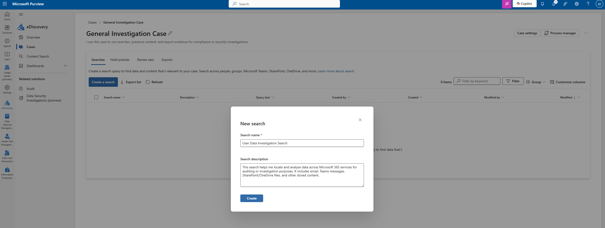

# 17. eDiscovery & Audit

Microsoft Purview – Investigation & Compliance Tools

In this chapter, I configured the basics of eDiscovery (Standard) and explored the Audit capabilities in Microsoft Purview.
Both tools help me support internal investigations, locate user data, and review activity logs across Microsoft 365 services.

---

## 1. Purpose

I use Microsoft Purview eDiscovery and Audit to:

 - Search for user activity across Exchange, SharePoint, OneDrive, and Teams
 - Investigate incidents or suspicious behavior
 - Preserve and export content for compliance or security needs
 - Review audit logs showing who accessed or modified data
 - Maintain accountability and visibility across my Microsoft 365 environment

This level of monitoring helps me ensure my environment remains secure and compliant.

## 2. Creating an eDiscovery Case

From Purview → eDiscovery → Cases, I created a new investigation case.

- Case Name: General Investigation Case
- Description: I use this case to run searches, preserve content, and export evidence for compliance or security investigations.

---

## 3. Creating an eDiscovery Search

Inside my new case, I selected Create a search and added:

- Search Name: User Data Investigation Search
- Search Description: This search helps me locate and analyze data across Microsoft 365 services for auditing or investigation purposes. It includes email, Teams messages, SharePoint/OneDrive files, and other stored content.

---

## 4. Audit Search in Microsoft Purview

Next, I moved to Purview → Audit to explore activity logs.
Audit logs allow me to track:

- User sign-ins
- File access and sharing
- Mailbox activity
- Teams messages and meeting actions
- Admin changes
- DLP rule triggers
- And much more

I can filter by date range, users, activities, workloads, record types, and file names.

---

## 5. Audit Search Results

When I run a search, I can view detailed activity logs.
For example, a typical search result shows:

-  Date and time
- User
- IP address
- Workload (SharePoint, Exchange, Teams, etc.)
- Activity performed
- Item name (file, email, etc.)
- Additional details

---

## 7. Summary

In this chapter, I created an eDiscovery investigation workflow and learned how to use Purview Audit to monitor activity.

| Component                | Purpose                                                      |
| ------------------------ | ------------------------------------------------------------ |
| **eDiscovery Case**      | A workspace to run searches and preserve data                |
| **Investigation Search** | Searches across email, Teams, SharePoint, and OneDrive       |
| **Audit Search**         | Tracks user activity across Microsoft 365                    |
| **Audit Logs**           | Show detailed events like file access, sharing, rule matches |

These tools give me essential visibility into what is happening across my Microsoft 365 tenant and allow me to respond to security or compliance requirements effectively.
