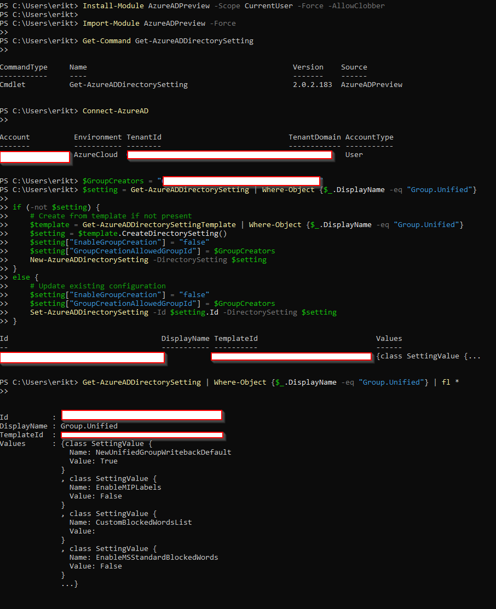

# Restricting Microsoft 365 Group & Teams Creation with PowerShell

In this part of my Modern Workplace project, I configured tenant-wide governance so that **only a dedicated admin group can create Microsoft 365 Groups and Microsoft Teams**.

By default, any licensed user in Microsoft 365 can create:

- Microsoft Teams
- Microsoft 365 Groups
- SharePoint Team Sites (connected)
- Planner Plans
- Yammer/Viva communities

This leads to **Teams sprawl, inconsistent governance, and uncontrolled SharePoint sites**.  
To fix this, I created a dedicated security group and used PowerShell to restrict group creation.

---

## Goals

My goals for this configuration were:

- Only my admin team can create new Microsoft 365 Groups and Teams  
- Normal users cannot create their own Teams / groups  
- I have a clean foundation for Teams governance and lifecycle management  
- This setting is enforced at the **tenant level** in Entra ID

---

## 1. Create the “M365-Group-Creators” Security Group

I started in **Microsoft Entra admin center**:

1. Go to: `https://entra.microsoft.com`
2. Navigate to: **Groups → All groups**
3. Click **New group**

I configured the group as:

- **Group type:** Security  
- **Group name:** `M365-Group-Creators`  
- **Description:** `Allowed to create Microsoft 365 Groups and Teams`  
- **Microsoft Entra roles can be assigned to the group:** No  
- **Membership type:** Assigned  

Then I added only my admin accounts as **members**:

- Global Administrator
- Teams / SharePoint administrators
- My own admin account (so I can create Teams)

I did **not** add devices, service accounts, or dynamic groups.  
This group is the only one that will be allowed to create Microsoft 365 Groups.

---

## 2. Install and Load the AzureADPreview Module (Local PowerShell)

On my admin workstation, I opened **Windows PowerShell** and installed the **AzureADPreview** module in my user scope:

```powershell
Install-Module AzureADPreview -Scope CurrentUser -Force -AllowClobber
```

Then I loaded the module:

```powershell
Get-Command Get-AzureADDirectorySetting
```

Finally, I connected to my tenant:

```powershell
Connect-AzureAD
```
I signed in with my admin account for the tenant.

---

## 3. Apply the Group Creation Restriction

Next, I used the Object ID of my M365-Group-Creators group.
In my tenant I found my ID and applied. 

Then I ran the following script to configure the Group.Unified directory setting:

```powershell
# ID of my M365-Group-Creators security group
$GroupCreators = ...

# Try to get existing Group.Unified settings
$setting = Get-AzureADDirectorySetting | Where-Object {$_.DisplayName -eq "Group.Unified"}

if (-not $setting) {
    # Create settings from template if they don't exist
    $template = Get-AzureADDirectorySettingTemplate | Where-Object {$_.DisplayName -eq "Group.Unified"}
    $setting  = $template.CreateDirectorySetting()

    $setting["EnableGroupCreation"]      = "false"
    $setting["GroupCreationAllowedGroupId"] = $GroupCreators

    New-AzureADDirectorySetting -DirectorySetting $setting
}
else {
    # Update existing Group.Unified configuration
    $setting["EnableGroupCreation"]      = "false"
    $setting["GroupCreationAllowedGroupId"] = $GroupCreators

    Set-AzureADDirectorySetting -Id $setting.Id -DirectorySetting $setting
}

# Verify the configuration
Get-AzureADDirectorySetting |
    Where-Object {$_.DisplayName -eq "Group.Unified"} |
    Format-List *
```

## 4. Verification

At the end, I validated the configuration from the Format-List output.

The important values I checked were:

```powershell
Get-AzureADDirectorySetting | Where-Object {$_.DisplayName -eq "Group.Unified"} | fl *
```




